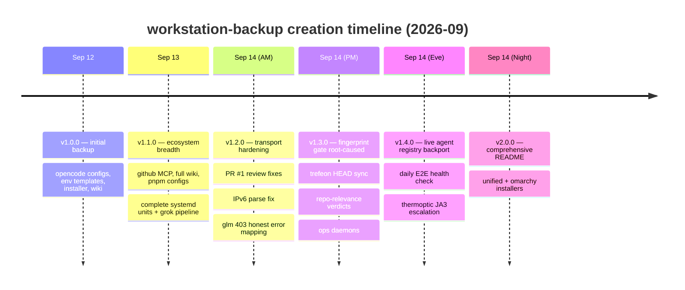

<div align="center">

# workstation-backup

[](https://github.com/marktantongco/workstation-backup/actions/workflows/ci.yml)

**Complete-ecosystem backup & one-command restore for the x3 AI workstation.**

One repo that can rebuild the whole rig: opencode configs, agents & skills wiring,
env templates, five Go/Python service stacks, systemd units, ops daemons,
the daily E2E health check, and the knowledge wiki.

`git clone git@github.com:marktantongco/workstation-backup.git && cd workstation-backup && ./install.sh`

*Private · maintained by marktantongco · secrets never committed (see [Secrets policy](#secrets-policy))*

</div>

---

## What repo is this?

**`github.com/marktantongco/workstation-backup`** (private). It is the canonical,
versioned backup of the x3 workstation's AI ecosystem — not an application repo.
Its siblings receive code; this repo receives everything needed to **stand the
workstation back up from zero**: configs (verbatim, `{env:VAR}`-based), redacted
env templates, systemd units, ops scripts, per-project dependency configs,
selected Go sources, installers, and a 13-note wiki documenting every incident,
fix, and decision since 2026-09-11.

## Quick start

| Path | Command | What you get |
|---|---|---|
| **Any Linux + systemd** | `./install.sh` | The classic 8-stage restore (configs → env templates → gateway → scanner → units → pnpm → exporter → ops daemons) |
| **Complete restore incl. health check + escalation** | `./install-unified.sh` | Everything in `install.sh` **plus** the E2E health check, thermoptic escalation wiring, Go-proxy source restore/build, and a post-restore smoke check (stage 12) |
| **Fresh Omarchy (Arch) machine** | `sudo ./install-omarchy.sh` | System prep (packages, docker, Go, Node, NVIDIA optional) → skills → then the full unified install |

All installers are idempotent: existing files are backed up with a timestamp
suffix before being replaced, and re-runs converge to the same state.

## What's inside

```
workstation-backup/
├── install.sh                 # classic 8-stage restore
├── install-unified.sh         # complete restore: install.sh + health/escalation/proxies
├── install-omarchy.sh         # Arch/Omarchy system prep → unified install
├── env/                       # redacted env templates (<REPLACE_ME> placeholders)
├── opencode/                  # opencode.jsonc, AGENTS.md, 5 agents, 24 commands, 3 plugins
├── projects/                  # per-project dependency configs + key Go sources
│   ├── BlacklistedAIProxy/    #   pnpm workspace (playwright 26.04 fix, allowBuilds)
│   ├── kiro-auto-pro-linux/   #   pnpm workspace (eslint 9.39.5 pin)
│   ├── freebuff-proxy/        #   internal/{freebuff,stealth,app} sources
│   └── freebuff-unified/      #   internal/{freebuff,stealth} + cmd sources
├── services/
│   ├── systemd/               # 20 unit files (+ agpx-relay user unit)
│   ├── freebuff-unified/      # gateway config template
│   ├── e2e-health/            # daily model health check + JA3 escalation script
│   └── thermoptic/            # loopback publish override for proxyrouter :31280
├── tools/                     # export.py, opencode-failover, owl-sync, owl-watch
└── wiki/                      # 13 dated notes: incidents, root causes, verdicts
```

## Version changes

| Version | Date | Commit | Changes |
|---|---|---|---|
| **v2.1.1** | 2026-09-14 | *this release* | **Automated GitHub releases from this table** (CI release job on `v*` tags, after all validation jobs pass); rolling pacman/apt/npx caches in CI smoke jobs; post-tag E2E baseline captured (all 8 cells transport-OK, QUOTA account state) |
| v2.1.0 | 2026-09-14 | `1dd5a7a` | **CI on every push** (shellcheck + mermaid render check + Arch/Debian container smoke tests of both installers); container-test fixes (`sudo -H` handoff, `restore_tree` source resolution, systemd guards, root corepack, `pciutils`); Node 24 action targets (checkout v7, setup-node v7); **stage-12 post-restore smoke check** in `install-unified.sh` (curl both proxies, advisory) |
| v2.0.0 | 2026-09-14 | `aa21302` | Comprehensive README; **`install-unified.sh`** (complete unified installer with E2E health + JA3 escalation + proxy sources); **`install-omarchy.sh`** (Omarchy/Arch variant) |
| v1.4.0 | 2026-09-14 | `167a6c1` | Live agent-pairing registry backport to both Go proxies (`17a792d`/`113c8ef`); daily E2E health check + thermoptic JA3 escalation; thermoptic `:31280` loopback publish |
| v1.3.0 | 2026-09-14 | `2243ece` | Fingerprint-fix sources synced; 15-repo relevance verdicts (`15baf13`); stealth spike record (`2332af6`); gateway config/units/installer synced to live (`2243ece`); ops daemons backed up (`5c77130`) |
| v1.2.0 | 2026-09-14 | `c7e06a8` | Transport hardening snapshot (`786ba19`); review fixes (`9d8ee9d`); IPv6 bracketed-endpoint fix (`de36c3b`); glm 403 root cause → honest `free_mode_invalid_agent_model` mapping (`c7e06a8`) |
| v1.1.0 | 2026-09-13 | `2e3f0a1` | GitHub MCP enable (`e3e3ad2`); comprehensive wiki + blacklisted-api service (`2823a13`); pnpm workspace configs with Playwright 26.04 fix (`5c77280`); eslint 9.39.5 pin (`cac8525`); complete systemd units + grok pipeline (`2e3f0a1`) |
| v1.0.0 | 2026-09-12 | `bff27a6` | Initial backup: opencode configs, env templates, installer, wiki |

## Creation timeline



## Worktree schematic

```mermaid
graph TD
    ROOT[workstation-backup]
    ROOT --> INST[installers]
    INST --> I1[install.sh<br/>classic 8-stage]
    INST --> I2[install-unified.sh<br/>complete restore]
    INST --> I3[install-omarchy.sh<br/>Arch system prep]

    ROOT --> ENV[env/<br/>4 redacted templates]
    ROOT --> OC[opencode/]
    OC --> OCC[jsonc + AGENTS.md]
    OC --> OCA[agents/ ×5]
    OC --> OCCM[commands/ ×24]
    OC --> OCP[plugins/<br/>rtk · freebuff · caveman]

    ROOT --> PROJ[projects/]
    PROJ --> P1[BlacklistedAIProxy<br/>pnpm workspace]
    PROJ --> P2[kiro-auto-pro-linux<br/>pnpm workspace]
    PROJ --> P3[freebuff-proxy<br/>internal Go sources]
    PROJ --> P4[freebuff-unified<br/>internal Go sources]

    ROOT --> SVC[services/]
    SVC --> S1[systemd/ ×20 units]
    SVC --> S2[freebuff-unified/<br/>gateway config]
    SVC --> S3[e2e-health/<br/>health + escalation]
    SVC --> S4[thermoptic/<br/>:31280 publish]

    ROOT --> TOOLS[tools/<br/>export · failover · owl-sync · owl-watch]
    ROOT --> WIKI[wiki/ ×13 notes]

    style ROOT fill:#1a1b26,color:#7aa2f7
    style INST fill:#16161e,color:#bb9af7
    style PROJ fill:#16161e,color:#9ece6a
    style SVC fill:#16161e,color:#e0af68
```



## Secrets policy

Raw env/token files are **never committed anywhere** — only `{env:VAR}`
references or `<REPLACE_ME>` templates. The 11-family pre-commit secret
scanner (`workspace/pre-commit`, wired via `core.hooksPath`) is armed on this
repo and blocks any commit introducing secret-shaped strings. Restored env
files install as templates; fill them from your password manager, then
`sudo systemctl restart freebuff-unified`.

## Restore runbook (disaster recovery)

1. `git clone git@github.com:marktantongco/workstation-backup.git && cd workstation-backup`
2. Omarchy/Arch: `sudo ./install-omarchy.sh` — any other Linux: `./install-unified.sh`
3. Fill placeholders: `nano ~/.env-tokens/ai-agent-tokens-full.env`
4. Regenerate agent-env from the token file (see wiki `09-disaster-recovery.md`)
5. Validate:
   ```bash
   opencode debug config | python3 -m json.tool | head -n 30
   opencode models | wc -l        # expect 49
   opencode mcp list              # expect 11, 6 connected
   systemctl list-timers freebuff-e2e-health.timer
   curl -s http://127.0.0.1:18080/healthz
   ```

## Keeping the backup current

After any ecosystem change: re-copy changed configs into this repo, re-run the
secret scan (automatic on commit), commit + push. The wiki's dated notes
(`00`–`13`) are the interpretive layer — add one for every incident or
architecture decision worth remembering.

## The living system this repo restores

| Service | Port | Role |
|---|---|---|
| freebuff-proxy (Go) | 1455 | Freebuff upstream proxy — SDK-faithful requests, live agent registry, token pool |
| freebuff-unified (Go) | 18080 | API gateway — multi-provider routing, passthrough to the trefeon container |
| freebuff-proxy-trefeon (Docker) | 3457 | Upstream's newer proxy fork — live 43-agent/21-model registry |
| thermoptic (Docker ×3) | 1234/14111/**31280** | Chrome-cloaked egress — automatic JA3 escalation path |
| freebuff2api (+admin) | — | Python/FastAPI gateway + admin panel |
| freebuff-e2e-health (timer) | — | Daily 07:15 UTC model health check with fingerprint escalation |
