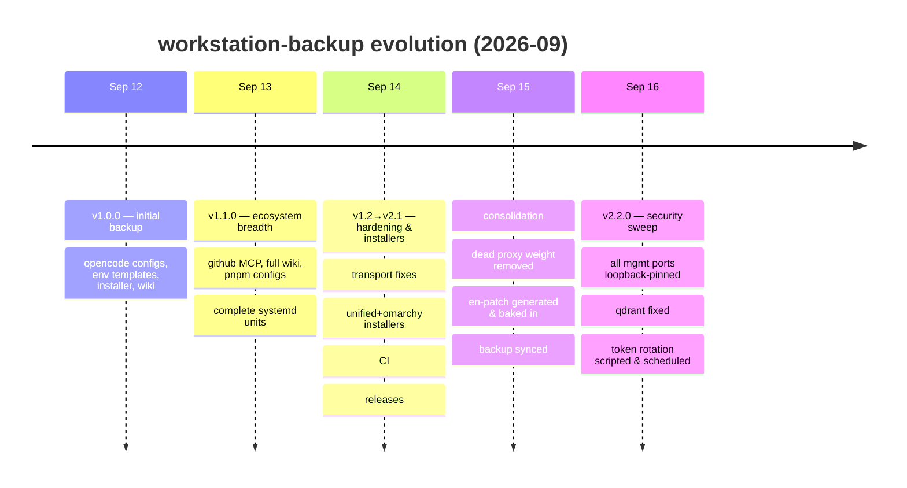
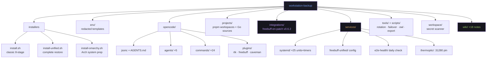

<div align="center">

# workstation-backup

[](https://github.com/marktantongco/workstation-backup/actions/workflows/ci.yml)

**Complete-ecosystem backup & one-command restore for the x3 AI workstation.**

One repo that can rebuild the whole rig: opencode configs, agents & skills wiring,
env templates, the hardened two-layer freebuff proxy chain, systemd units & timers,
ops runbooks, the daily E2E health check, security integrations, and an 18-note
knowledge wiki.

`git clone git@github.com:marktantongco/workstation-backup.git && cd workstation-backup && ./install.sh`

*Private · maintained by marktantongco · secrets never committed (see [Secrets policy](#secrets-policy))*

</div>

---

## What repo is this?

**`github.com/marktantongco/workstation-backup`** (private). It is the canonical,
versioned backup of the x3 workstation's AI ecosystem — not an application repo.
Its siblings receive code; this repo receives everything needed to **stand the
workstation back up from zero**: configs (verbatim, `{env:VAR}`-based), redacted
env templates, systemd units & timers, ops scripts, per-project dependency
configs, selected Go sources, security integrations, installers, and a dated wiki
(`00`–`17`) documenting every incident, fix, and decision since 2026-09-11.

## Production architecture (as of 2026-09-16, all verified live)

```
clients (LAN) ──► freebuff-unified :18080        ← the ONLY intentional LAN door
                  (auth via fbu_ API keys,          (401 without key, verified)
                   rate limits, passthrough)
                        │
                        ▼  http://127.0.0.1:3457 (credential-free passthrough)
                  freebuff-proxy-trefeon :3457    ← 127.0.0.1-pinned Docker container
                  (Go: token pool, sessions,
                   quota, admin dashboard with
                   EN UI patch v0.6.2 baked in)
                        │
                        ▼
                   codebuff.com
```

**Hardening posture (all applied & verified 2026-09-16):**

| Surface | Before | Now |
|---|---|---|
| trefeon admin/healthz :3457 | `0.0.0.0` | `127.0.0.1` (compose pin) |
| unified dashboard :9091 | `*` | `127.0.0.1` (config pin) |
| owl-api metrics :9094 / owl-prometheus :9095 | `0.0.0.0` | `127.0.0.1` (compose pin) |
| qdrant :6333/:6334 (was unauthenticated!) | `0.0.0.0` | `127.0.0.1` (compose pin) |
| ADMIN_TOKEN | factory `123456` → `admin1234` | **random 20-char, rotated weekly by timer** |

Every management/monitoring port now refuses LAN connections; external probes
verified refused. Remaining `0.0.0.0` listeners are app services with their own
auth (see wiki `17` for the full exposure scan and open items).

## Quick start

| Path | Command | What you get |
|---|---|---|
| **Any Linux + systemd** | `./install.sh` | The classic 8-stage restore (configs → env templates → gateway → scanner → units → pnpm → exporter → ops daemons) |
| **Complete restore incl. health check + escalation** | `./install-unified.sh` | Everything in `install.sh` **plus** the E2E health check, thermoptic escalation wiring, Go-proxy source restore/build, and a post-restore smoke check (stage 12) |
| **Fresh Omarchy (Arch) machine** | `sudo ./install-omarchy.sh` | System prep (packages, docker, Go, Node, NVIDIA optional) → skills → then the full unified install |

All installers are idempotent: existing files are backed up with a timestamp
suffix before being replaced, and re-runs converge to the same state.

## What's inside

```
workstation-backup/
├── install.sh                 # classic 8-stage restore
├── install-unified.sh         # complete restore: install.sh + health/escalation/proxies
├── install-omarchy.sh         # Arch/Omarchy system prep → unified install
├── env/                       # redacted env templates (<REPLACE_ME> placeholders)
├── opencode/                  # opencode.jsonc, AGENTS.md, 5 agents, 24 commands, 3 plugins
├── projects/                  # per-project dependency configs + key Go sources
│   ├── BlacklistedAIProxy/    #   pnpm workspace (playwright 26.04 fix, allowBuilds)
│   ├── kiro-auto-pro-linux/   #   pnpm workspace (eslint 9.39.5 pin)
│   ├── freebuff-proxy/        #   internal/{freebuff,stealth,app} sources
│   └── freebuff-unified/      #   internal/{freebuff,stealth} + cmd sources
├── integrations/
│   └── freebuff-en-patch/     # EN UI patch v0.6.2: generator, tests, installer,
│                              #   byte-verified against the deployed trefeon image
├── services/
│   ├── systemd/               # 25 unit files incl. freebuff-admin-token-rotation.{service,timer}
│   ├── freebuff-unified/      # gateway config template
│   ├── e2e-health/            # daily model health check + JA3 escalation script
│   └── thermoptic/            # loopback publish override for proxyrouter :31280
├── scripts/
│   └── runbook-admin-token-rotation.sh   # mirror of the unified runbook
├── tools/
│   ├── export.py, opencode-failover, owl-sync, owl-watch, check-mermaid.sh
│   └── rotate-admin-token.sh  # mirror of trefeon scripts/rotate-admin-token.sh
├── workspace/                 # pre-commit secret scanner (11 families)
└── wiki/                      # 18 dated notes: incidents, root causes, verdicts, scans
```

## ADMIN_TOKEN rotation (standing procedure)

The trefeon admin token is rotated **weekly, automatically**:

```
freebuff-admin-token-rotation.timer  (Mon 04:17 +≤30m jitter, Persistent)
  └─► freebuff-admin-token-rotation.service (oneshot, User=x3)
        └─► runbook.sh admin-token-rotation        (freebuff-unified scripts/runbooks/)
              └─► rotate-admin-token.sh            (trefeon scripts/, mirrored in tools/)
```

- Flow: login → `fb_csrf` cookie → `X-CSRF-Token` header →
  `POST /admin/api/change-password`; then **self-verifies** (new token 302,
  old token rejected, `.env` persisted) and exits non-zero on any failure.
- The token value never appears in argv, output, or logs (0600 tmpfs files,
  curl `@file` bodies). No container restart needed.
- Retrieve after rotation: `sudo grep '^ADMIN_TOKEN=' ~/aiworkspace/trefeon-freebuff-proxy/.env`
- Manual run: `runbook.sh admin-token-rotation` · supply your own value with
  `TOKEN_FILE=/dev/shm/mytoken rotate-admin-token.sh` (≥16 chars, URL-safe).
- Check schedule: `systemctl list-timers freebuff-admin-token-rotation.timer`

Live-verified three times on 2026-09-16 (two manual, one via systemd).

## Version changes

| Version | Date | Commit | Changes |
|---|---|---|---|
| **v2.2.0** | 2026-09-16 | *this release* | **Loopback hardening sweep**: trefeon :3457, unified dashboard :9091, owl :9094/:9095, qdrant :6333/:6334 all pinned; **ADMIN_TOKEN rotation scripted + scheduled** (runbook, service, weekly timer, live-verified); Grafana verified non-factory; full LAN exposure scan recorded (wiki `17`); en-patch v0.6.2 bake-in + browser verification; freebuff2api/hermes/lmarena/ghcr-proxy retired after 24h-traffic evidence; leaked-PAT removal from wiki clone remote |
| v2.1.1 | 2026-09-14 | release | Automated GitHub releases from this table (CI release job on `v*` tags); rolling caches in CI smoke jobs; post-tag E2E baseline (all 8 cells transport-OK) |
| v2.1.0 | 2026-09-14 | `1dd5a7a` | CI on every push (shellcheck + mermaid + Arch/Debian container smoke of both installers); stage-12 post-restore smoke check in `install-unified.sh` |
| v2.0.0 | 2026-09-14 | `aa21302` | Comprehensive README; `install-unified.sh`; `install-omarchy.sh` |
| v1.4.0 | 2026-09-14 | `167a6c1` | Live agent-pairing registry backport; daily E2E health check + JA3 escalation; thermoptic `:31280` loopback publish |
| v1.3.0 | 2026-09-14 | `2243ece` | Fingerprint-fix sources synced; 15-repo relevance verdicts; stealth spike record |
| v1.2.0 | 2026-09-14 | `c7e06a8` | Transport hardening snapshot; IPv6 bracketed-endpoint fix; glm 403 honest error mapping |
| v1.1.0 | 2026-09-13 | `2e3f0a1` | GitHub MCP enable; comprehensive wiki; pnpm workspace configs; complete systemd units |
| v1.0.0 | 2026-09-12 | `bff27a6` | Initial backup: opencode configs, env templates, installer, wiki |

## Creation timeline



## Worktree schematic



## Secrets policy

Raw env/token files are **never committed anywhere** — only `{env:VAR}`
references or `<REPLACE_ME>` templates. The 11-family pre-commit secret
scanner (`workspace/pre-commit`, wired via `core.hooksPath`) is armed on this
repo and blocks any commit introducing secret-shaped strings. Restored env
files install as templates; fill them from your password manager, then
`sudo systemctl restart freebuff-unified`.

Also enforced: **no tokens in git remote URLs**. The wiki project's clone had
a live PAT embedded in its remote URL (removed 2026-09-16; the PAT itself
must be revoked at github.com/settings/tokens). Auth everywhere goes through
the gh keyring (`gh auth status`).

## Restore runbook (disaster recovery)

1. `git clone git@github.com:marktantongco/workstation-backup.git && cd workstation-backup`
2. Omarchy/Arch: `sudo ./install-omarchy.sh` — any other Linux: `./install-unified.sh`
3. Fill placeholders: `nano ~/.env-tokens/ai-agent-tokens-full.env`
4. Regenerate agent-env from the token file (see wiki `09-disaster-recovery.md`)
5. Re-apply the 2026-09-16 hardening (loopback pins live in the projects'
   compose files — `projects/` sources + the pins noted in wiki `10`/`17`;
   compose copies in this repo already carry them where the project is mirrored)
6. Rotate the admin token once (the timer will keep it fresh):
   ```bash
   tools/rotate-admin-token.sh
   ```
7. Validate:
   ```bash
   opencode debug config | python3 -m json.tool | head -n 30
   opencode models | wc -l        # expect 49
   opencode mcp list              # expect 11, 6 connected
   systemctl list-timers freebuff-e2e-health.timer freebuff-admin-token-rotation.timer
   curl -s http://127.0.0.1:18080/healthz
   curl -s http://127.0.0.1:3457/healthz                     # loopback only
   curl -s -o /dev/null -w '%{http_code}' http://127.0.0.1:3457/admin/assets/freebuff-en.js  # 200
   ss -tlnp | grep -E ':(3457|9091|6333|9094|9095)'           # all must be 127.0.0.1
   ```

## Keeping the backup current

After any ecosystem change: re-copy changed configs into this repo, re-run the
secret scan (automatic on commit), commit + push. The wiki's dated notes
(`00`–`17`) are the interpretive layer — add one for every incident or
architecture decision worth remembering.

## The living system this repo restores

**Production chain (the serving path):**

| Service | Port | Role |
|---|---|---|
| freebuff-unified (Go, systemd) | `0.0.0.0:18080` | API gateway — fbu_ API-key auth, rate limits, credential-free passthrough to trefeon; dashboard loopback `127.0.0.1:9091` |
| freebuff-proxy-trefeon (Docker) | `127.0.0.1:3457` | Production core — 43-agent/21-model registry, token pool, sessions, quota; admin dashboard (EN patch v0.6.2 baked in); UNFIT_EGRESS knob |
| BlacklistedAIProxy (node, :3005) | active | gemini/kiro/grok/qwen relay — 9.4k req/24h |

**Supporting stack:**

| Service | Port | Role |
|---|---|---|
| freebuff-e2e-health (timer) | — | Daily 07:15 UTC model health check with JA3 escalation |
| freebuff-admin-token-rotation (timer) | — | Weekly Mon ~04:17 ADMIN_TOKEN rotation (self-verifying) |
| owl-agent stack (containers) | 60001 (LAN, key-gated), 9094/9095 (loopback) | DNS-synergy API, Prometheus, MCP, gateway |
| thermoptic (Docker ×3) | 1234/14111/31280 (all loopback) | Chrome-cloaked egress — JA3 escalation path |
| obsidian stack (qdrant/khoj/anythingllm) | 6333/6334 loopback; 42110/3002 LAN | Vector DB + wiki AI services |
| headroom, grokbuild, nim-relay, kiropool | various | Evidence-backed single-purpose relays |

**Retired 2026-09-15/16 (documented in wiki `08`/`15`):** `freebuff-proxy.service`
(:1455 port-conflict crash-looper), freebuff2api + admin (0 traffic/24h),
hermes-sidecar + lmarena-stealth-proxy (0 traffic/24h, stealth disabled),
ghcr.io/hengxin666 freebuff-proxy container (unhealthy crash-loop, no ports).
