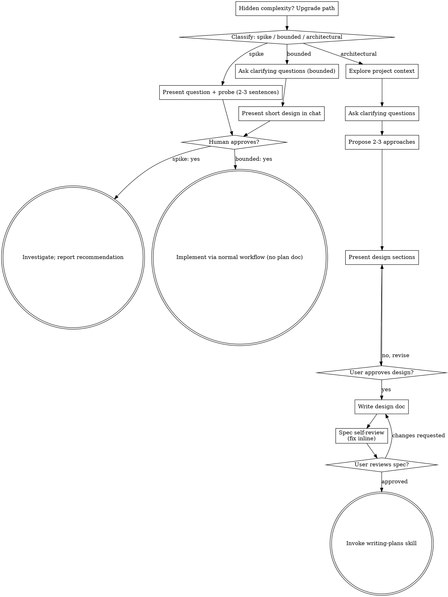

# Latest Lineage OS for Pixel 5

- **Session ID:** `ses_f66ff2192ffe37kG6GGIFk7TxW`
- **Directory:** /home/x3/workspace
- **Started:** 2026-09-13 12:22:46
- **Last activity:** 2026-09-13 17:43:10
- **Messages:** 14

---

### 🧑 User — 2026-09-13 12:22:46

how to download latest lineage os for pixel 5

---

### 🤖 Assistant — 2026-09-13 12:22:47

> User asks how to download latest LineageOS for Pixel 5. This is a factual/research question, not a coding task. Let me check if a skill applies. This is informational — "download latest lineage os for pixel 5". Could use web search for current info. The parallel-search MCP or websearch tool.
> 
> LineageOS for Pixel 5 (redfin). Latest official version. Let me search web for current status.
> 
> Caveman mode active. Keep terse. Answer directly.

**tool:parallel-search_web_search** (completed) 

```
objective=Find how to download the latest official LineageOS build for Google Pixel 5 (cod; search_queries=['LineageOS Pixel 5 redfin download', 'LineageOS latest version Pixel 5 2026', '; session_id=9f3a2c1e8b7d4a5f6c0e1b2a3d4c5e6f
--- output ---
{
  "search_id": "search_d5ab351d1b2c30178aa44c8bc6d0885a",
  "results": [
    {
      "url": "https://download.lineageos.org/devices/redfin",
      "title": "Builds for redfin | LineageOS Downloads",
      "publish_date": null,
      "excerpts": [
        "Google Pixel 5 redfin\nHome Builds Changes Guides & info\nDownload builds\nNot all images are necessary for installation or upgrades. Check your device's wiki guides for more info. You can verify that a file has not been tampered by checking its signature .\nLatest\nlineage-23.2-20260831-nightly-redfin-signed.zip\nboot.img\ndtbo.img\nsuper_empty.img\nvbmeta.img\nvendor_boot.img\nbuild-manifest.xml\nlineage-23.2-20260824-nightly-redfin-signed.zip\nboot.img\ndtbo.img\nsuper_empty.img\nvbmeta.img\nvendor_boot.img\nbuild-manifest.xml\nlineage-23.2-20260817-nightly-redfin-signed.zip\nboot.img\ndtbo.img\nsuper_empty.img\nvbmeta.img\nvendor_boot.img\nbuild-manifest.xml"
      ]
    },
    {
      "url": "https://wiki.lineageos.org/devices/redfin/build",
      "title": "Build LineageOS for Google Pixel 5 - redfin",
      "publish_date": null,
      "excerpts": [
        "Build LineageOS for Google Pixel 5 - redfin\nIt's free – just download and run a virtual machine (VM) such as VirtualBox, then install a Linux distribution such as Ubuntu (AOSP vets Ubuntu as well). Any"
      ]
    },
    {
      "url": "https://download.lineageos.org/redfin",
      "title": "Builds for redfin | LineageOS Downloads",
      "publish_date": null,
      "excerpts": [
        "Builds for redfin | LineageOS Downloads\n96.0 MiB f0959efdffb82fb1c0fa56b308ad5400d4aab99a56f264c0a1bd7ffbccfa0d21 lineage-23.2-20260622-nightly-redfin-signed.zip 2026-06-22 Android 16 June 2026 nightly\n > \nLineageOS Downloads\nNot all images are necessary for installation or upgrades. Check your device's wiki guides for more info. You can verify that a file has not been tampered by checking its signature.\n > \nBuilds for redfin | LineageOS Downloads\nNot all images are necessary for installation or upgrades. Check your device's wiki guides for more info. You can verify that a file has not been tampered by checking its signature."
      ]
    },
    {
      "url": "https://wiki.lineageos.org/devices/redfin/install",
      "title": "Install LineageOS on Google Pixel 5 - redfin",
      "publish_date": null,
      "excerpts": [
        "Install LineageOS on Google Pixel 5 - redfin\nInstall LineageOS on Google Pixel 5 . The provided instructions are for LineageOS 23.2. Setup instructions can be found here. 2026 The LineageOS Project\n > \nInstall LineageOS on redfin | LineageOS Wiki\nWarning: Unlocking the bootloader will erase all data on your device! Before proceeding, ensure the data you would like to retain is backed up to your PC and/or your Google account, or equivalent.\n > \nInstall LineageOS on redfin | LineageOS Wiki\nThe required version is Android 14, which may be lower than the LineageOS version you are about to install - this is not an error! If there are multiple updates of that version (e.g. security updates), make sure to use the latest!\n > \nInstall LineageOS on redfin | LineageOS Wiki\nkeyboard_arrow_left Back to the overview Install LineageOS on Google Pixel 5 redfin\nInstall LineageOS on Google Pixel 5 - redfin\nMake sure your computer has adb and fastboot . Setup instructions can be found here. Enable USB debugging on your device. Boot your device with the stock OS\n > \nInstall LineageOS on Google Pixel 5 - redfin\nBasic requirements: Boot your device with the stock OS at least once and check every functionality.\n > \nInstall LineageOS on redfin | LineageOS Wiki\nWarning: If you want to install Google Apps add-on package (use the arm64 architecture), you can download it from here. This add-on needs to be installed before booting into LineageOS for the first time!\n > \nInstall LineageOS on Google Pixel 5 - redfin\nThe required version is Android 14, which may be lower than the LineageOS version you are about to install - this is not an error! If there are multiple updates"
      ]
    },
    {
      "url": "https://ota.mindphone.co/redfin",
      "title": "LineageOS Downloads",
      "publish_date": null,
      "excerpts": [
        "Builds for redfin\nRecent changes • Device info • Installation instructions\n* Type | Version | File | Size | Date\n  You can verify a file has not been tampered with by checking its signature. More information on how to do this can be found here .\n  © 2017-2026 LineageOS. Licensed under Apache 2.0. Source (version: dev)"
      ]
    },
    {
      "url": "https://inhishonor.github.io/lineage_wiki/devices/redfin",
      "title": "Info about redfin | LineageOS Wiki",
      "publish_date": null,
      "excerpts": [
        "LineageOS Wiki Toggle navigation\n* Devices\n* Contribute\n* FAQ\n* Glossary\n* lineageos.org open_in_new\n  search\n  Use light theme\n  light_mode\n  keyboard_arrow_left Devices\nGoogle Pixel 5\ncodename: redfin\nDownloads\nGet the builds here\nGuides\n* Installation\n* Build for yourself\n* Update to a newer build of the same LineageOS version\n* Upgrade to a higher version of LineageOS (e.g. lineage-22.1 -> lineage-23.2)\nSpecial boot modes\n* Google Pixel 5 (redfin)\n* Released | October 2020\n* Specifications\n* SoC | Qualcomm SM7250 Snapdragon 765G\n* RAM | 8 GB\n* CPU | Octa-core\n* Kryo 475\n* 1 x 2.4 GHz + 1 x 2.2 GHz + 6 x 1.8 GHz\n* Architecture | arm64\n* GPU | Qualcomm Adreno 620\n* Network | * 2G GSM\n* 3G UMTS\n* 3G CDMA2000\n* 4G LTE\n* 5G NR\n* Storage | 128 GB\n* Screen | 6 in (152.4 mm)\n* 2340x1080 (429 PPI)\n* AMOLED (max. 90 Hz)\n* Bluetooth | 5 with A2DP + aptX HD\n* Wi-Fi | 802.11 a/b/g/n/ac\n* Peripherals | * Accelerometer\n* Compass\n* eSIM\n* Fingerprint reader\n* BeiDou\n* Galileo\n* GLONASS\n* GPS\n* Gyroscope\n* Light sensor\n* NFC\n* Proximity sensor\n* Qi wireless charging\n* Qi reverse wireless charging\n* USB OTG\n* Cameras | 3\n* 12.2 MP, LED flash\n* 16 MP (ultrawide), No flash\n* 8 MP,\n* No flash\n* Dimensions | 144.7 mm (5.7 in) (h)\n* 70.4 mm (2.77 in) (w)\n* 8 mm (0.31 in) (d)\n* Battery | Non-removable Li-Po 4080 mAh\n* LineageOS info\n* Maintainer | * mikeioannina\n* Current version | * 23.2 (Android 16)\n* Kernel version | * 4.19\n* ( source code )\n* Previously supported versions | * 18.1 (Android 11)\n* 19.1 (Android 12L)\n* 20 (Android 13)\n* 21 (Android 14)\n* 22.1 (Android 15)\n* 22.2 (Android 15)\n* 23.0 (Android 16) |\n© 2016 - 2026 The LineageOS Project\nLicensed under CC BY-SA 3.0 . Site last generated: Apr 11, 2026"
      ]
    },
    {
      "url": "https://support.halabtech.com/index.php?a=downloads&b=folder&id=106079",
      "title": "Google Pixel 5 (Redfin) | HalabTech Support | Firmware Downloads, FRP Tools, Flash Files & Mobile Repair",
      "publish_date": null,
      "excerpts": [
        "Grid\nList redfin-ota-up1a.231105.001-cb2967ff.zip Date: 08-02-2024 | Size: 1.88 GB Download redfin-ota-up1a.231005.007-4593d7c6.zip Date: 08-02-2024 | Size: 1.88 GB Download redfin-ota-tq3a.230901.001.c2-fc8ea12b.zip Date: 08-02-2024 | Size: 1.85 GB Download redfin-ota-tq3a.230901.001-eac0a8f6.zip Date: 08-02-2024 | Size: 1.85 GB Download redfin-ota-tq3a.230805.001.a2-91515243.zip Date: 08-02-2024 | Size: 1.85 GB Download redfin-ota-tq3a.230805.001-b3e4d755.zip Date: 08-02-2024 | Size: 1.85 GB Download redfin-ota-tq3a.230705.001-b600a937.zip Date: 08-02-2024 | Size: 1.85 GB Download redfin-ota-tq3a.230605.011-0c154cfb.zip Date: 08-02-2024 | Size: 1.85 GB Download redfin-ota-tq2a.230505.002.a1-c1fa91bb.zip Date: 08-02-2024 | Size: 1.82 GB Download"
      ]
    },
    {
      "url": "https://crdroid.net/redfin/12",
      "title": "crDroid.net - Download crDroid v12 for Pixel 5 (redfin)",
      "publish_date": null,
      "excerpts": [
        "You are now ready to download and install\ncrDroid 12 based on Android 16 for Pixel 5 Check below info to get started Back to all devices download page device image\ncrDroid for Pixel 5\nOEM | Google\nCodename | redfin\nMaintainer | Bobby Panarisi\nNickname | 306bobby\nVersion | 12.11\nAndroid | 16\nBuild date | 2026-06-29\nZIP size | 1402 MB\nBuild type | Monthly MD5 SHA256\ncrDroid downloads:\nDownload latest version Download older versions\nUseful links:\nHow to install Ask for support Changelog Gapps Recovery Donate\ncrDroid Android Project\nFor device-specific support, please use the forum or Telegram links on the device download page. Email: contact@crdroid.net"
      ]
    },
    {
      "url": "https://github.com/vk1111111/LineageOS-Pixel-Guide",
      "title": "GitHub - vk1111111/LineageOS-Pixel-Guide: An unofficial guide to installing Lineage OS on a Pixel device · GitHub",
      "publish_date": null,
      "excerpts": [
        "vk1111111/LineageOS-Pixel-Guide\n* Page: GitHub repository\n* URL: https://github.com/vk1111111/LineageOS-Pixel-Guide\n* Description: An unofficial guide to installing Lineage OS on a Pixel device - vk1111111/LineageOS-Pixel-Guide\n* Stars: 3\n* Forks: 0\n* Default branch: main\n* Created: 2023-09-11T21:28:22.000Z\n* Commits: 11\nTop-level files\n* README.md\nYou MUST put the LineageOS ROM and all of the provided .img files in the platform-tools folder for the flashing to work later.\nPixel 7:\nFor the Pixel 7 series, we will be needed the LineageOS zip as well as 4 img files:\n* Lineage OS (Download links are below)\n* boot.img\n* dtbo.img\n* vendor_kernel_boot.img\n* vendor_boot.img\nPixel 6:\nFor the Pixel 6 series, we will be needed the LineageOS zip as well as 3 img files:\n* Lineage OS (Download links are below)\n* boot.img\n* dtbo.img\n* vendor_boot.img\nPixel 5:\nFor the Pixel 5 series, we will be needed the LineageOS zip as well as 3 img files:\n* Lineage OS (Download links are below)\n* boot.img\n* dtbo.img\n* vendor_boot.img\nLinks:\n* Devices | Download\n* Pixel 7 | panther\n* Pixel 7 Pro | cheetah\n* Pixel 7a | lynx\n* Pixel 6 | oriole\n* Pixel 6 Pro | raven\n* Pixel 6a | bluejay\n* Pixel 5 | redfin\n* Pixel 5a | barbet\n  If your device is not listed here, unfortunately this guide does NOT cover your device at this moment.\nb) Google Apps/Services (Gapps)\n! NOTICE !\nThis is the section of the tutorial where we flash the LineageOS ZIPfile onto the Pixel. the phone MUST stay plugged into the PC until we're done with flashing.\nMAKE SURE YOU HAVE THE LINEAGEOS AND GAPPS ZIPFILE IN THE SAME DIRECTORY AS platform-tools TO SIDELOAD AND FLASH.\nNow head over to the CMD window open on your computer and type this command:\nadb sideload [LINEAGE OS ZIPFILE NAME].zip\nreplace [LINEAGEOS ZIPFILE NAME] with the name of the LineageOS zipfile.\nWait for it to flash.\nc) GAPPS\nCONGRATS! 🎉\nYou have installed Lineage OS. If you encounter any errors, consider getting support from the Official Discord server.\nhttps://discord.com/invite/gD6DMtf\n© 2016 - 2023 The LineageOS Project\nLineageOS LLC is not a 501(c)(3) non-profit, as such donations are not tax-exempt.\nUnofficial Pixel guide by arm64 and Yeet1000."
      ]
    },
    {
      "url": "https://images.ecloud.global/official/redfin",
      "title": "/e/OS official redfin download",
      "publish_date": null,
      "excerpts": [
        "Android 13 Latest MD5 SHA256 recovery image SHA256 MD5 SHA256 recovery image SHA256 MD5 SHA256 recovery image SHA256 MD5 SHA256 recovery image SHA256 MD5 SHA256 recovery image SHA256 MD5 SHA256 recovery image SHA256 MD5 SHA256 recovery image SHA256 MD5 SHA256 recovery image SHA256 MD5 SHA256 recovery image SHA256 MD5 SHA256 recovery image SHA256 MD5 SHA256 recovery image SHA256 MD5 SHA256 recovery image SHA256 MD5 SHA256 recovery image SHA256 MD5 SHA256 recovery image SHA256 MD5 SHA256 recovery image SHA256 MD5 SHA256 recovery image SHA256 MD5 SHA256 recovery image SHA256 MD5 SHA256 recovery image SHA256 MD5 SHA256 recovery image SHA256 Android 12 Latest MD5 SHA256 recovery image SHA256 Android 11 Latest MD5 SHA256 recovery image SHA256 e Foundation"
      ]
    }
  ],
  "warnings": null,
  "metadata": null,
  "session_id": "9f3a2c1e8b7d4a5f6c0e1b2a3d4c5e6f"
}
```

---

### 🤖 Assistant — 2026-09-13 12:22:56

> Answer direct. Latest: LineageOS 23.2 (Android 16), nightly builds for redfin (Pixel 5). Latest shown 2026-08-31 nightly. Download page: https://download.lineageos.org/devices/redfin. Install guide: https://wiki.lineageos.org/devices/redfin/install. Terse.

Latest: **LineageOS 23.2** (Android 16), nightly builds, Pixel 5 codename **redfin**.

Download: https://download.lineageos.org/devices/redfin
- `lineage-23.2-20260831-nightly-redfin-signed.zip` (latest)
- Grab `.img` files alongside: `boot.img`, `dtbo.img`, `vendor_boot.img`, plus `vbmeta.img`/`super_empty.img` if install guide needs them

Install guide: https://wiki.lineageos.org/devices/redfin/install
- Needs bootloader unlock (erases device), `adb` + `fastboot`, stock Android 14 required first
- GApps (optional, arm64) install before first boot

Steps: unlock bootloader → flash images → reboot recovery → `adb sideload` the zip.

---

### 🧑 User — 2026-09-13 17:37:10

investigate brainstorm github-research deep-analysis deep-dive orchestrate i would like to integrate these links with my computer: https://github.com/MrKrugen/BlacklistedAIProxy

https://github.com/getphantomsignal/phantomsignal
https://github.com/EfrainGaray/phantomrelay

https://github.com/mandatoryprogrammer/thermoptic
https://github.com/zackiles/cdp-proxy-interceptor
https://github.com/madeye/https_proxy

https://github.com/paklandcity/opus-4-7-desktop-interface establish a rating per repo and define its secret sauce, capabilities and use-case, give 3 ideas of integrate by combining and 3 ideas by stacking. give me 3 wild ideas of possibilities.

---

### 🤖 Assistant — 2026-09-13 17:37:11

Using evaluate-candidates to rate repos + brainstorming to design integrations.

**tool:skill** (completed) Loaded skill: evaluate-candidates

```
name=evaluate-candidates
--- output ---
<skill_content name="evaluate-candidates">
# Skill: evaluate-candidates

# Evaluate GitHub Candidate Repos

After a search surfaces plausible candidates, the user typically wants a close look at 2–5 finalists before committing. This skill produces a structured side-by-side evaluation using `gh api` to inspect each repo.

## When to use

Trigger phrases include:
- "Compare these repos"
- "Look closer at X and Y"
- "Which of these should I use?"
- "Evaluate this project before I fork it"

Accept candidates as either a list of `owner/repo` identifiers or the output of a previous `search-repos` / `search-ai-tools` run.

## Procedure

For each candidate, collect the following signals. Run these in parallel where possible.

### 1. Core metadata

```bash
gh api repos/<owner>/<repo> --jq '{
  full_name, description, homepage,
  stars: .stargazers_count, forks: .forks_count,
  open_issues: .open_issues_count,
  created: .created_at, pushed: .pushed_at, updated: .updated_at,
  language, license: .license.spdx_id,
  default_branch, archived, disabled,
  has_issues, has_wiki, has_discussions
}'
```

### 2. README

```bash
gh api repos/<owner>/<repo>/readme --jq '.content' | base64 -d | head -200
```

Summarize in 2–3 sentences: what it does, who it's for, and installation/usage shape (library vs CLI vs service).

### 3. Maintenance health

- **Recent commits** (last 10):
  ```bash
  gh api "repos/<owner>/<repo>/commits?per_page=10" --jq '.[] | {date: .commit.author.date, msg: .commit.message | split("\n")[0], author: .commit.author.name}'
  ```
- **Contributor count**:
  ```bash
  gh api "repos/<owner>/<repo>/contributors?per_page=100" --jq 'length'
  ```
  Solo-maintainer projects are higher risk.
- **Releases**:
  ```bash
  gh api "repos/<owner>/<repo>/releases?per_page=5" --jq '.[] | {tag: .tag_name, date: .published_at}'
  ```
  Regular releases are a strong positive signal.
- **Open vs closed issue ratio**:
  ```bash
  gh api "search/issues?q=repo:<owner>/<repo>+type:issue+state:open" --jq '.total_count'
  gh api "search/issues?q=repo:<owner>/<repo>+type:issue+state:closed" --jq '.total_count'
  ```
  A huge open pile with few closes suggests the maintainer has disengaged.

### 4. Code-quality signals

Check the tree for common markers:

```bash
gh api "repos/<owner>/<repo>/contents" --jq '.[].name'
```

Look for:
- `tests/`, `test/`, `__tests__/`, `*_test.go`, `spec/` → tests exist
- `.github/workflows/` → CI configured
- `CONTRIBUTING.md`, `CODE_OF_CONDUCT.md` → project welcomes contribution
- `CHANGELOG.md` → actively tracked history
- Lockfiles (`package-lock.json`, `poetry.lock`, `Cargo.lock`, `go.sum`) → reproducible builds
- `Dockerfile`, `docker-compose.yml` → deploy story
- Documentation site (`docs/`, mkdocs, docusaurus) → serious project

### 5. License clarity

Flag: missing license, non-OSI license, license mismatch between package metadata and repo, copyleft (GPL/AGPL) vs permissive (MIT/Apache-2.0/BSD). This matters if the user plans to integrate.

### 6. Issues: look at the last 5 open

```bash
gh api "repos/<owner>/<repo>/issues?state=open&per_page=5" --jq '.[] | {title, created: .created_at, labels: [.labels[].name], author: .user.login}'
```

Are they user-facing bugs with no maintainer response? That's a red flag.

### 7. Produce a recommendation

For each candidate output:

- **Verdict** — one of: *recommend*, *maybe*, *avoid*, with one-line reason.
- **Strengths** — 2–3 bullets.
- **Concerns** — 2–3 bullets (or fewer if clean).
- **Fit** — does it match what the user described needing?

End with a summary ranking across the candidates and a clear recommendation of which to try first, or a "none are great, here's why" honest verdict if applicable.

## Guidance

- **Don't oversell.** If none of the candidates look good, say so and suggest widening the search or building from scratch.
- **Solo-maintainer risk is real** for anything load-bearing. Note it.
- **Recent activity matters more than star count** for production decisions.
- **License problems are deal-breakers** for integration — surface these prominently, not as footnotes.

Base directory for this skill: /home/x3/.opencode/skills/evaluate-candidates
Relative paths in this skill (e.g., scripts/, reference/) are relative to this base directory.
Note: file list is sampled.

<skill_files>

</skill_files>
</skill_content>
```

---

### 🤖 Assistant — 2026-09-13 17:37:23

Skill loaded. Now loading brainstorming method for integration ideation.

**tool:skill** (completed) Loaded skill: brainstorming

```
name=brainstorming
--- output ---
<skill_content name="brainstorming">
# Skill: brainstorming

# Brainstorming Ideas Into Designs

Help turn ideas into fully formed designs and specs through natural collaborative dialogue.

Start by classifying how much process the request needs, then work
through your path: understand the context, refine the idea, present a
design, and get your human partner's approval.

<HARD-GATE>
Do NOT invoke any implementation skill, write any code, scaffold any
project, or take any implementation action until you have told your
human partner what you intend and they have approved it. This applies
to EVERY task on EVERY path below — the ceremony scales with the task;
the approval gate never does.
</HARD-GATE>

## Three Paths

Before your first question, classify the request and say the
classification out loud — "this looks bounded, so I'll present a short
design here rather than write a spec" — so your human partner can
override it:

- **Spike** — a feasibility question ("can we...", "is it possible...",
  "quick and dirty is fine") whose output is an answer, not code you
  keep. Present the question and what you'll try in 2-3 sentences, get
  a nod, then find out as cheaply as correctness allows. No design
  doc, no spec file. Report findings as a recommendation; anything you
  built stays labeled throwaway.
- **Bounded** — a well-scoped change to code that already exists in
  this repo: a new flag, a small endpoint, a one-file fix.
  Understanding the kind of app is not enough — bounded means the flow
  you are changing is already here to read. If there is no existing
  flow to change, the task is not bounded. Ask the clarifying
  questions that matter, present a short design IN CHAT (a few
  sentences to a few short paragraphs), and STOP. Implementation
  starts only after your human partner says yes to that design — a
  bounded task's approval is as hard a gate as an architectural
  one. No spec file, no implementation plan document.
- **Architectural** — new projects, new subsystems, changes that
  restructure how components fit together or alter interfaces others
  depend on. Follow the full process: questions, approaches, sectioned
  design, written spec, then the writing-plans skill.

When in doubt between two paths, take the heavier one. The ratchet is
one-way: hidden complexity discovered mid-task upgrades the path —
stop, say so, and step up. Nothing downgrades mid-task.

## Anti-Pattern: "Too Simple To Need Approval"

Every path ends with your human partner approving your intent before
implementation. A todo list, a single-function utility, a config
change — the design may be two sentences in chat, but you MUST present
it and get approval. "Simple" tasks are where unexamined assumptions
cause the most wasted work. What scales with simplicity is the
artifact, never the approval.

## Red Flags

| Thought | Reality |
|---------|---------|
| "This is too simple to need a design" | Simple means a short design, not no design. Two sentences in chat, then approval. |
| "I'll call it bounded and skip the spec" | Reaching for a label to skip work IS the doubt — take the heavier path. |
| "It's bounded and the design is obvious — I'll start while they read it" | The gate is the approval, not the design's length. Present, then stop until you hear yes. |
| "I understand this kind of app, so it's bounded" | Bounded measures the repo, not your familiarity. A new project has no existing flow — it is architectural. |
| "The spike works, so I'll keep the code" | A spike's output is an answer. Keeping the code is a new request — classify it. |
| "It grew, but I'm almost done — no need to re-classify" | Hidden complexity upgrades the path mid-task. Stop and say so. |
| "They approved the spike, so the follow-up change is approved too" | Each task gets its own classification and its own approval. |

## Checklist

Classify first, announce the path, then create a task for each item on
your path and complete them in order.

**Spike:**
1. **Explore project context** — enough to frame the probe
2. **Present question + probe plan** — 2-3 sentences
3. **Get approval** — a nod is enough
4. **Investigate** — as cheaply as correctness allows
5. **Report findings** — a recommendation; label anything built as throwaway

**Bounded:**
1. **Explore project context** — check files, docs, recent commits
2. **Ask clarifying questions** — one at a time, the ones that matter
3. **Present short design in chat** — approach, files touched, testing
4. **Get approval** — STOP and wait for an explicit yes; presenting the design and starting in the same breath is skipping the gate
5. **Implement** — proceed with the normal development workflow (TDD applies); no plan document

**Architectural:**
1. **Explore project context** — check files, docs, recent commits
2. **Offer the visual companion just-in-time** — NOT upfront. The first time a question would genuinely be clearer shown than described, offer it then (its own message); on approval its browser tab opens for you. If no visual question ever arises, never offer it. See the Visual Companion section below.
3. **Ask clarifying questions** — one at a time, understand purpose/constraints/success criteria
4. **Propose 2-3 approaches** — with trade-offs and your recommendation
5. **Present design** — in sections scaled to their complexity, get user approval after each section
6. **Write design doc** — save to `docs/superpowers/specs/YYYY-MM-DD-<topic>-design.md` and commit
7. **Spec self-review** — quick inline check for placeholders, contradictions, ambiguity, scope (see below)
8. **User reviews written spec** — ask user to review the spec file before proceeding
9. **Transition to implementation** — invoke writing-plans skill to create implementation plan

## Process Flow



**Terminal states are path-bound.** Architectural: the ONLY skill you
invoke after brainstorming is writing-plans — never frontend-design,
mcp-builder, or any other implementation skill. Bounded: after
approval, implementation proceeds directly through the normal
development workflow; no plan document. Spike: the terminal state is a
reported recommendation.

## The Process

The subsections below serve the bounded and architectural paths (a
spike stops at "present the probe, get a nod"). Sections from
**Exploring approaches** onward are architectural-path depth — for
bounded work, context plus a few questions plus a short in-chat design
is the whole process.

**Understanding the idea:**

- Check out the current project state first (files, docs, recent commits)
- Before asking detailed questions, assess scope: if the request describes multiple independent subsystems (e.g., "build a platform with chat, file storage, billing, and analytics"), flag this immediately. Don't spend questions refining details of a project that needs to be decomposed first.
- If the project is too large for a single spec, help the user decompose into sub-projects: what are the independent pieces, how do they relate, what order should they be built? Then brainstorm the first sub-project through the normal design flow. Each sub-project gets its own spec → plan → implementation cycle.
- For appropriately-scoped projects, ask questions one at a time to refine the idea
- Prefer multiple choice questions when possible, but open-ended is fine too
- Only one question per message - if a topic needs more exploration, break it into multiple questions
- Focus on understanding: purpose, constraints, success criteria

**Exploring approaches:**

- Propose 2-3 different approaches with trade-offs
- Present options conversationally with your recommendation and reasoning
- Lead with your recommended option and explain why
- YAGNI ruthlessly - remove unnecessary features from every approach and design

**Presenting the design:**

- Once you believe you understand what you're building, present the design
- Scale each section to its complexity: a few sentences if straightforward, up to 200-300 words if nuanced
- Ask after each section whether it looks right so far
- Cover: architecture, components, data flow, error handling, testing
- Be ready to go back and clarify if something doesn't make sense

**Design for isolation and clarity:**

- Break the system into smaller units that each have one clear purpose, communicate through well-defined interfaces, and can be understood and tested independently
- For each unit, you should be able to answer: what does it do, how do you use it, and what does it depend on?
- Can someone understand what a unit does without reading its internals? Can you change the internals without breaking consumers? If not, the boundaries need work.
- Smaller, well-bounded units are also easier for you to work with - you reason better about code you can hold in context at once, and your edits are more reliable when files are focused. When a file grows large, that's often a signal that it's doing too much.

**Working in existing codebases:**

- Explore the current structure before proposing changes. Follow existing patterns.
- Where existing code has problems that affect the work (e.g., a file that's grown too large, unclear boundaries, tangled responsibilities), include targeted improvements as part of the design - the way a good developer improves code they're working in.
- Don't propose unrelated refactoring. Stay focused on what serves the current goal.

## After the Design (architectural path)
```

---

### 🤖 Assistant — 2026-09-13 17:37:27

Classification: architectural exploration. No code until you approve design. Starting repo probe now.

**tool:todowrite** (completed) 3 todos

```
todos=[{'content': 'Probe 7 repos metadata + README + health', 'status': 'in_progress'
--- output ---
[
  {
    "content": "Probe 7 repos metadata + README + health",
    "status": "in_progress",
    "priority": "high"
  },
  {
    "content": "Rate each repo + secret sauce + use-case",
    "status": "pending",
    "priority": "high"
  },
  {
    "content": "Design 3 combine + 3 stack + 3 wild integrations",
    "status": "pending",
    "priority": "high"
  }
]
```

---

### 🤖 Assistant — 2026-09-13 17:37:33

**tool:bash** (completed) for r in MrKrugen/BlacklistedAIProxy getphantomsignal/phantomsignal EfrainGaray/phantomrelay mandatoryprogrammer/thermoptic zackiles/cdp-proxy-interceptor madeye/https_proxy paklandcity/opus-4-7-desktop-interface; do echo "=== $r ==="; gh api repos/$r --jq '{full_name, description, stars: .stargazers_count, forks: .forks_count, open_issues: .open_issues_count, created: .created_at, pushed: .pushed_at, language, license: .license.spdx_id, archived, default_branch}' 2>&1; echo; done

```
command=for r in MrKrugen/BlacklistedAIProxy getphantomsignal/phantomsignal EfrainGaray/
--- output ---
=== MrKrugen/BlacklistedAIProxy ===
{"archived":false,"created":"2026-05-24T11:42:49Z","default_branch":"main","description":"Stop paying to use AI in your favorite apps! BlacklistedAPI gives you free, unlimited access to elite models like Gemini, Claude, and Grok without a single paid API key. It spoofs these services into one OpenAI-compatible gateway, supporting thousands of daily requests. Perfect for \"vibe coding\" and AI powered app use FREE. ","forks":5,"full_name":"MrKrugen/BlacklistedAIProxy","language":"JavaScript","license":"GPL-3.0","open_issues":0,"pushed":"2026-05-24T11:45:33Z","stars":47}

=== getphantomsignal/phantomsignal ===
{"archived":false,"created":"2026-05-25T19:21:37Z","default_branch":"main","description":"The OPSEC-native OSINT framework: a stealth egress layer (proxy pool, adaptive pacing, JA3/JA4) under every module + an honest per-scan report of what you leaked. DNS/port/tech recon, nuclei vuln scanning, 54+ intel sources (many keyless), identity Profiler, best-of-breed engine orchestration. Web · CLI · REST. pip install phantomsignal","forks":0,"full_name":"getphantomsignal/phantomsignal","language":"Python","license":"NOASSERTION","open_issues":0,"pushed":"2026-07-26T20:06:53Z","stars":0}

=== EfrainGaray/phantomrelay ===
{"archived":false,"created":"2026-04-01T16:05:33Z","default_branch":"main","description":"Production-grade stealth browser relay — Chrome TLS/JA4 fingerprint (BoringSSL), 5-service decomposed architecture, ISolver CAPTCHA strategy (reCAPTCHA/Turnstile/DataDome/PerimeterX), Redis distributed rate limiting, EventEmitter proxy health, Docker remote Chrome, 732 tests","forks":0,"full_name":"EfrainGaray/phantomrelay","language":"TypeScript","license":"MIT","open_issues":1,"pushed":"2026-08-15T07:10:37Z","stars":1}

=== mandatoryprogrammer/thermoptic ===
{"archived":false,"created":"2025-09-02T04:44:12Z","default_branch":"main","description":"A next-generation HTTP stealth proxy which perfectly cloaks requests as the Chrome browser across all layers of the stack.","forks":67,"full_name":"mandatoryprogrammer/thermoptic","language":"JavaScript","license":null,"open_issues":15,"pushed":"2026-03-31T00:32:48Z","stars":1045}

=== zackiles/cdp-proxy-interceptor ===
{"archived":false,"created":"2025-02-14T05:46:33Z","default_branch":"main","description":"Transparent man-in-the-middle (MitM) proxy for the Chrome DevTools Protocol (CDP). Intercept, modify, inject, and filter messages and events between a CDP-enabled browser and any clients interacting with it such as Playwright or Puppeteer.","forks":2,"full_name":"zackiles/cdp-proxy-interceptor","language":"TypeScript","license":"MIT","open_issues":3,"pushed":"2025-02-17T04:13:59Z","stars":21}

=== madeye/https_proxy ===
{"archived":false,"created":"2026-03-12T03:35:25Z","default_branch":"master","description":"Stealth HTTPS forward proxy with automatic Let's Encrypt TLS and nginx camouflage","forks":2,"full_name":"madeye/https_proxy","language":"Rust","license":null,"open_issues":0,"pushed":"2026-03-18T08:29:22Z","stars":28}

=== paklandcity/opus-4-7-desktop-interface ===
{"archived":false,"created":"2026-05-25T08:50:51Z","default_branch":"main","description":"🚀 ChatGPT-5.5 Desktop 2026 – Unlimited Free GPT Codex \u0026 Prompts","forks":3,"full_name":"paklandcity/opus-4-7-desktop-interface","language":"HTML","license":null,"open_issues":0,"pushed":"2026-09-13T05:33:50Z","stars":2}
```

**tool:bash** (completed) for r in MrKrugen/BlacklistedAIProxy getphantomsignal/phantomsignal EfrainGaray/phantomrelay mandatoryprogrammer/thermoptic zackiles/cdp-proxy-interceptor madeye/https_proxy paklandcity/opus-4-7-desktop-interface; do echo "=== $r TREE ==="; gh api repos/$r/contents --jq '.[].name' 2>&1 | head -40; echo; done

```
command=for r in MrKrugen/BlacklistedAIProxy getphantomsignal/phantomsignal EfrainGaray/
--- output ---
=== MrKrugen/BlacklistedAIProxy TREE ===
.babelrc
.dockerignore
.env.example
.github
.gitignore
BUILD_INSTRUCTIONS.md
CHANGELOG.md
CONTRIBUTING.md
Dockerfile
LICENSE
README-JA.md
README-ZH.md
README.md
SECURITY.md
STEALTH_TODO.md
VERSION
build-full-automated.bat
configs
desktop
docker-compose.otel.yml
docker
docs
healthcheck.js
install-and-run.bat
install-and-run.ps1
install-and-run.sh
installer
jest.config.js
otel-collector-config.yaml
package-lock.json
package.json
plugin-concepts.md
pnpm-lock.yaml
promptfoo.yaml
run-tests.js
src
static
test-summary.js
tests
tls-sidecar

=== getphantomsignal/phantomsignal TREE ===
.dockerignore
.github
.gitignore
CHANGELOG.md
CODE_OF_CONDUCT.md
CONTRIBUTING.md
Dockerfile
LICENSE
MANIFEST.in
README.md
SECURITY.md
docker-compose.yml
docs
phantomsignal
requirements.txt
run.py
scripts
setup.py
specs

=== EfrainGaray/phantomrelay TREE ===
.dockerignore
.env.example
.github
.gitignore
.kamal
.prettierignore
.prettierrc
.woodpecker.yml
CLAUDE.md
INTEGRATION_HF.md
LICENSE
README.md
apps
config
docker
eslint.config.js
package.json
packages
pnpm-lock.yaml
pnpm-workspace.yaml
scripts
tsconfig.base.json
turbo.json
vitest.config.ts

=== mandatoryprogrammer/thermoptic TREE ===
.github
.gitignore
AGENTS.md
DOWNSIDES.md
Dockerfile
README.md
TODO.md
_readme
browser-tests
cdp.js
certificates.js
chrome-profile
chrome
config.js
debug.js
docker-compose.ci.yml
docker-compose.gpu.yml
docker-compose.yml
docker-entrypoint.sh
fetchgen.js
healthcheck.js
hooks
logger.js
package-lock.json
package.json
proxy.js
proxyrouter
requestengine.js
routes.js
scripts
server.js
tutorials
utils.js
wait-for-cdp.js

=== zackiles/cdp-proxy-interceptor TREE ===
.cursor
.cursorignore
.deno-version
.env.example
.gitignore
.vscode
CONTRIBUTORS.md
LICENSE
README.md
TODO.md
biome.json
deno.jsonc
docs
plugins
scripts
src
test

=== madeye/https_proxy TREE ===
.claude
.githooks
.github
.gitignore
CLAUDE.md
Cargo.lock
Cargo.toml
README.md
config.example.yaml
docs
src
tests

=== paklandcity/opus-4-7-desktop-interface TREE ===
.github
README.md
index.html
```

---

### 🤖 Assistant — 2026-09-13 17:37:48

**tool:bash** (completed) for r in MrKrugen/BlacklistedAIProxy getphantomsignal/phantomsignal EfrainGaray/phantomrelay mandatoryprogrammer/thermoptic zackiles/cdp-proxy-interceptor madeye/https_proxy paklandcity/opus-4-7-desktop-interface; do echo "===== $r COMMITS ====="; gh api repos/$r/commits?per_page=5 --jq '.[] | "\(.commit.author.date) | \(.commit.author.name) | \(.commit.message | split("\n")[0] | .[0:120])"' 2>&1; echo "----- $r RELEASES -----"; gh api repos/$r/releases?per_page=3 --jq '.[] | "\(.tag_name) @ \(.published_at)"' 2>&1; echo "----- $r CONTRIBUTORS -----"; gh api repos/$r/contributors?per_page=20 --jq 'length' 2>&1; echo; done

```
command=for r in MrKrugen/BlacklistedAIProxy getphantomsignal/phantomsignal EfrainGaray/
--- output ---
===== MrKrugen/BlacklistedAIProxy COMMITS =====
2026-05-24T11:45:33Z | MrKrugen | Create build.yml
2026-05-07T19:19:02Z | Rob | Merge pull request #18 from crazyrob425/copilot/analyze-provider-adapters
2026-05-07T03:59:12Z | copilot-swe-agent[bot] | Add cross-protocol request rebuild for retry failover
2026-05-06T07:28:55Z | Rob | fix: initialize Sentinel in handleAPIRequests and improve error detection in failsafe wrapper
2026-05-06T07:16:35Z | Rob | feat: implement JA3 rotation and header entropy in stealth-logic.js
----- MrKrugen/BlacklistedAIProxy RELEASES -----
----- MrKrugen/BlacklistedAIProxy CONTRIBUTORS -----
20

===== getphantomsignal/phantomsignal COMMITS =====
2026-07-26T19:35:51Z | the-clipper | A couple of small fixes.
2026-07-20T05:51:11Z | the-clipper | Merge pull request #10: ci — publish to PyPI via API token
2026-07-20T05:50:13Z | the-clipper | ci(publish): switch PyPI publish to API-token auth; docs
2026-07-20T05:23:34Z | the-clipper | Merge pull request #9: docs — PyPI publish troubleshooting
2026-07-20T05:22:19Z | the-clipper | docs(releasing): add PyPI publish troubleshooting (invalid-publisher, pending-vs-project 403)
----- getphantomsignal/phantomsignal RELEASES -----
v1.27.0 @ 2026-07-20T04:31:18Z
v1.24.0 @ 2026-07-12T22:28:41Z
v1.21.0 @ 2026-07-11T08:56:42Z
----- getphantomsignal/phantomsignal CONTRIBUTORS -----
1

===== EfrainGaray/phantomrelay COMMITS =====
2026-08-15T07:10:33Z | Efrain Garay | fix(ci): stealth job also skips the docs site, external probes are informational
2026-08-15T07:02:57Z | Efrain Garay | fix(ci): green pipeline, align docs with reality
2026-07-19T00:38:17Z | Efrain Garay | feat(http-client): route http mode through proxy via CONNECT tunnel
2026-07-18T21:09:49Z | Efrain Garay | feat(relay): add /v1/fetch raw anti-bot HTTP proxy endpoint
2026-07-18T16:34:18Z | Efrain Garay | docs: PhantomRelay as stealth CDP browser for pd-shorts Higgsfield pipeline
----- EfrainGaray/phantomrelay RELEASES -----
----- EfrainGaray/phantomrelay CONTRIBUTORS -----
1

===== mandatoryprogrammer/thermoptic COMMITS =====
2026-03-31T00:32:47Z | Matthew Bryant | Merge pull request #43 from mandatoryprogrammer/ci/github-actions-e2e
2026-03-31T00:27:44Z | mandatory | Fix checkout auth for CI
2026-03-31T00:22:45Z | mandatory | Harden GitHub Actions permissions
2026-03-31T00:14:13Z | mandatory | Clarify compose smoke test logging
2026-03-31T00:06:44Z | mandatory | Trim CI to Linux-hosted Docker runners
----- mandatoryprogrammer/thermoptic RELEASES -----
----- mandatoryprogrammer/thermoptic CONTRIBUTORS -----
1

===== zackiles/cdp-proxy-interceptor COMMITS =====
2025-02-17T04:13:49Z | Zachary Iles | refactor: streamline WebSocket and Chrome management code
2025-02-16T14:14:00Z | Zachary Iles | fix(plugins): remove duplicate plugin
2025-02-16T14:13:31Z | Zachary Iles | fix(tests): fix broken plugin_manager test
2025-02-16T11:01:35Z | Zachary Iles | chore: add Deno version specification and update README
2025-02-16T10:41:10Z | Zachary Iles | Playwright stealth (#7)
----- zackiles/cdp-proxy-interceptor RELEASES -----
----- zackiles/cdp-proxy-interceptor CONTRIBUTORS -----
1

===== madeye/https_proxy COMMITS =====
2026-03-18T08:29:16Z | Max Lv | Add pre-commit hook for cargo fmt check
2026-03-18T08:26:35Z | Max Lv | Fix cargo fmt formatting to pass CI
2026-03-14T04:09:10Z | Max Lv | Optimize throughput: 128K tunnel buffers, streaming bodies, connection pooling
2026-03-13T09:19:20Z | Max Lv | Change proxy auth realm from "proxy" to "Restricted" for stealth
2026-03-13T08:33:54Z | Max Lv | Update landing page for v0.3.0: new features, modules, and download links
----- madeye/https_proxy RELEASES -----
v0.3.0 @ 2026-03-13T03:53:18Z
v0.2.0 @ 2026-03-12T09:50:55Z
v0.1.0 @ 2026-03-12T04:05:46Z
----- madeye/https_proxy CONTRIBUTORS -----
1

===== paklandcity/opus-4-7-desktop-interface COMMITS =====
2026-09-13T05:33:49Z | github-actions[bot] | notify optimize #1158
2026-09-13T00:32:18Z | github-actions[bot] | cleanup replace #1051
2026-09-12T22:45:23Z | github-actions[bot] | config decrypt #3304
2026-09-12T20:00:51Z | github-actions[bot] | load format #644
2026-09-12T17:37:16Z | github-actions[bot] | enhance downgrade #926
----- paklandcity/opus-4-7-desktop-interface RELEASES -----
----- paklandcity/opus-4-7-desktop-interface CONTRIBUTORS -----
2
```

**tool:bash** (completed) for r in MrKrugen/BlacklistedAIProxy getphantomsignal/phantomsignal EfrainGaray/phantomrelay mandatoryprogrammer/thermoptic zackiles/cdp-proxy-interceptor madeye/https_proxy paklandcity/opus-4-7-desktop-interface; do echo "===== $r README (first 3000 chars) ====="; gh api repos/$r/readme --jq '.content' 2>/dev/null | base64 -d 2>/dev/null | head -c 3000; echo; echo; done

```
command=for r in MrKrugen/BlacklistedAIProxy getphantomsignal/phantomsignal EfrainGaray/
--- output ---
===== MrKrugen/BlacklistedAIProxy README (first 3000 chars) =====
<div align="center">

```
██████╗ ██╗      █████╗  ██████╗██╗  ██╗██╗     ██╗███████╗████████╗███████╗██████╗      █████╗ ██████╗ ██╗
██╔══██╗██║     ██╔══██╗██╔════╝██║ ██╔╝██║     ██║██╔════╝╚══██╔══╝██╔════╝██╔══██╗    ██╔══██╗██╔══██╗██║
██████╔╝██║     ███████║██║     █████╔╝ ██║     ██║███████╗   ██║   █████╗  ██║  ██║    ███████║██████╔╝██║
██╔══██╗██║     ██╔══██║██║     ██╔═██╗ ██║     ██║╚════██║   ██║   ██╔══╝  ██║  ██║    ██╔══██║██╔═══╝ ██║
██████╔╝███████╗██║  ██║╚██████╗██║  ██╗███████╗██║███████║   ██║   ███████╗██████╔╝    ██║  ██║██║     ██║
╚═════╝ ╚══════╝╚═╝  ╚═╝ ╚═════╝╚═╝  ╚═╝╚══════╝╚═╝╚══════╝   ╚═╝   ╚══════╝╚═════╝     ╚═╝  ╚═╝╚═╝     ╚═╝
```

**[ Blacklisted Binary Labs ]** — *We didn't get the memo saying we had to play nice.*

[](https://github.com/crazyrob425/BlacklistedAIProxy)
[](https://www.gnu.org/licenses/gpl-3.0)
[](https://nodejs.org/)
[](https://hub.docker.com/r/crazyrob425/blacklisted-api)
[](https://github.com/crazyrob425/BlacklistedAIProxy/actions)

> *"They said you couldn't use those AI models in your own apps. We said 'hold my root beer.'  
> — BlacklistedAPI: the proxy that laughs at rate limits."*

</div>

---

## 💀 What Even IS This Thing?

**BlacklistedAPI** is an **OpenAI-compatible reverse proxy gateway** that jailbreaks the client-only restrictions on the world's most powerful AI models — Gemini CLI, Claude Kiro, Grok, Codex, Qwen Code, and more — and wraps them into a single, clean, standard API endpoint your apps can actually call.

> **In plain En

===== getphantomsignal/phantomsignal README (first 3000 chars) =====
# PhantomSignal

> **The OPSEC-native OSINT framework** — _"Map the surface. Own the signal."_
>
> Recon that doesn't burn your infrastructure — a stealth egress layer under every
> module, and an honest per-scan report of exactly what you leaked.

[](https://python.org)
[](LICENSE)
[]()
[](https://github.com/getphantomsignal/phantomsignal/stargazers)
[](https://github.com/getphantomsignal/phantomsignal/issues)
[](https://github.com/getphantomsignal/phantomsignal/actions/workflows/ci.yml)
[](https://pypi.org/project/phantomsignal/)
[](https://phantomsignal.sh)
[](CHANGELOG.md)


---

## ⚡ What's New in v1.27.0 — Identity intelligence + egress you can see

**The Profiler grew up.** Eight new **keyless** public sources feed it, every
run is now saved as a scan you can revisit and export, and the whole stealth
posture is visible in the navbar and survives a restart.

- **8 no-key identity sources** — XposedOrNot (breach exposure with no HIBP key),
  a GitHub commit-email harvester (real name + email from public commits),
  GitLab, Wikidata (DOB + cross-linked socials for named people), WebFinger
  (fediverse resolution), **offline phone intel** via libphonenumber (zero
  network egress), openFEC (US employer/occupation), and OpenCorporates.
- **Profiler → Scans** — a Profiler search now persists as a `people_intel` scan
  (with a linked shadow profile), so it lands in **Scans** with history,
  summary, and export. A **View in Scans** button jumps straight there.
- **Egress routed + graded** — the keyless sources inherit the shared proxy pool
  and land in the attribution ledger. A **STEALTH / PARTIAL / DIRECT** chip in
  the navbar shows your live posture at a glance.
- **Proxy pools in one click** — seed the rotating pool from curated free feeds,
  a custom URL, or an uploaded list, right from Scan Settings.
- **Settings persist** — stealth profile, proxy pool, rotation, and the rest now
  survive a restart.

See the [CHANGELOG](CHANGELOG.md#1270--2026-07-19) for the full

===== EfrainGaray/phantomrelay README (first 3000 chars) =====
# PhantomRelay

> **The world-class browser relay scraper.** Chrome TLS/JA4 fingerprint at the BoringSSL level, persistent profiles with real history aging, behavioral simulation, and native MCP server for Claude.

[](LICENSE)
[](https://github.com/EfrainGaray/phantomrelay/actions/workflows/ci.yml)
[](#)
[](#)
[](#)
[](#)
[](#)

---

## Why PhantomRelay?

Most scrapers get blocked because they fail at the TLS layer — before sending a single HTTP header. PhantomRelay fixes this from the ground up:

| | Browserless | Steel Browser | **PhantomRelay** |
|---|---|---|---|
| TLS JA3 cipher order | ❌ | ❌ | ✅ |
| **TLS JA4 extension order (BoringSSL)** | ❌ | ❌ | ✅ **only one** |
| HTTP/2 SETTINGS exact Chrome values | ❌ | Partial | ✅ |
| Profile aging (real Chrome SQLite history) | ❌ | ❌ | ✅ |
| Behavioral simulation (Bezier + Markov) | ❌ | ❌ | ✅ |
| Auto-escalation http→headless→stealth→human | ❌ | ❌ | ✅ |
| Native MCP server (Claude Desktop) | ❌ | ❌ | ✅ **only one** |

---

## How it works

```
Request → Mode selection
            │
            ├─ http    → BoringSSL TLS (JA4 = Chrome 124) + H2 SETTINGS spoofing
            ├─ headless → Chrome + 11 stealth patches (CDP + JS IIFE)
            ├─ stealth  → headless + Bezier mouse + Markov typing + scroll sim
            └─ human    → stealth + aged profile (6mo history) + proxy rotation
                                        │
                              auto mode → escalates automatically on block
```

---

## Quick start

### Prerequisites
- Node.js 24+
- pnpm 9+
- Rust toolchain (for JA4 native addon, optional)

```bash
git clone https://github.com/EfrainGaray/phantomrelay
cd phantomrelay
pnpm install
pnpm build

# Optional — compile the BoringSSL JA4 native addon (~75s, requires Rust)
cd packages/tls-native && npm run build && cd ../..
```

### Start the relay server

```bash
cp .env.example .env
# edit .env as needed
pnpm --filter @phantomrelay/relay start
```

### Using Docker (recommended for production)

```bash
docker compose -f docker/docker-compose.yml up -d
# relay on :3000, prometheus on :9091, grafana on :3001
```

---

## API — REST

### `POST /scrape` — Scrape a URL

```bash
# HTTP mode — fastest, TLS fingerprinting only
curl -X POST http://localhost:3000/scrape \
  -H "Content-Type: application/json" \
  -d '{"url": "https://example.com", "mode": "http"}'

# Headless mode — real Chrome, stealth injected
curl -X POST http://localhost

===== mandatoryprogrammer/thermoptic README (first 3000 chars) =====
# thermoptic

<!--  -->

<a href="https://www.youtube.com/watch?v=qkXReli7eC0" target="_blank"></a>

> *"I don't believe it, thermoptic camouflage!"*

## What is it?

This is an HTTP proxy designed to bypass services that use fingerprinting such as [JA4+](https://blog.foxio.io/ja4%2B-network-fingerprinting) to block certain HTTP clients. Using this proxy, you can use your preferred HTTP clients like `curl` and still have [magically](#how-does-that-work-exactly) indistinguishable fingerprints from a real (Chrome/Chromium) web browser. `thermoptic` also comes with some [fun features](#handling-browser-javascript-fingerprinting-with-thermoptic-hooks) to mitigate JavaScript-based fingerprinting. It also makes it easy to do hybrid scraping using both a web browser and low-level HTTP clients together.

Even if you’re unfamiliar with JA4+ fingerprinting, if you’ve done any scraping you’ve probably been blocked by it before. Popular services such as Cloudflare use such techniques (and other tricks) to detect use of "non-human" HTTP clients to block requests. These services can also use this fingerprinting to detect if you start a session with a real browser and then switch to a low-level client like `curl` later. `thermoptic` solves all of these problems by presenting a unified "real" browser fingerprint for all scraping requests.

## Example

Here's an example JA4H (HTTP) fingerprint of `curl` without the proxy:

```
$ curl https://ja4db.com/id/ja4h/
ge11nn090000_b6a016211e8a_000000000000_e3b0c44298fc
```

This is quite different from the fingerprint that Chrome produces when you visit the URL directly:

```
ge11cn19enus_f2808f0d04cf_9a10d4221160_7068f58def6e
```
```

---

### 🤖 Assistant — 2026-09-13 17:38:15

**tool:bash** (completed) echo "=== thermoptic open issues ==="; gh api repos/mandatoryprogrammer/thermoptic/issues?state=open\&per_page=5 --jq '.[] | "\(.title) | \(.created_at) | \(.user.login)"' 2>&1; echo "=== cdp-proxy open issues ==="; gh api repos/zackiles/cdp-proxy-interceptor/issues?state=open\&per_page=5 --jq '.[] | "\(.title) | \(.created_at) | \(.user.login)"' 2>&1; echo "=== phantomrelay open issues ==="; gh api repos/EfrainGaray/phantomrelay/issues?state=open\&per_page=5 --jq '.[] | "\(.title) | \(.created_at) | \(.user.login)"' 2>&1; echo "=== opus interface tree detail ==="; gh api repos/paklandcity/opus-4-7-desktop-interface/contents --jq '.[] | "\(.name) (\(.size) bytes)"' 2>&1

```
command=echo "=== thermoptic open issues ==="; gh api repos/mandatoryprogrammer/thermopt
--- output ---
=== thermoptic open issues ===
Fix response body decoding and header framing desync in CDP capture | 2026-09-09T23:27:28Z | m4dni5
Strip sec-ch-* client-hint headers by prefix for CORS classification | 2026-09-09T23:27:16Z | m4dni5
Strip DNT header so Firefox navigations route correctly | 2026-09-09T23:27:09Z | m4dni5
Seeking Senior Cyber-Security Expert for Advanced Behavioral Simulation & Fingerprint Spoofing (Contract) | 2026-09-07T05:19:29Z | axingbf888888-del
Disable Chrome's HttpsUpgrades feature to fix plain-HTTP proxying | 2026-07-27T22:26:07Z | bconik
=== cdp-proxy open issues ===
playwright-stealth-plugin.disabled.ts can't been loaded | 2025-07-07T03:16:04Z | alexliu-liu
session id in cdp request message is not equal to websocket session id in sessionManager | 2025-07-03T08:29:00Z | alexliu-liu
=== phantomrelay open issues ===
Native BoringSSL proxy support (JA4 + proxy egress simultaneously) | 2026-07-19T00:39:11Z | EfrainGaray
=== opus interface tree detail ===
.github (0 bytes)
README.md (1514 bytes)
index.html (25168 bytes)
```

---

### 🤖 Assistant — 2026-09-13 17:38:24

**tool:todowrite** (completed) 0 todos

```
todos=[{'content': 'Probe 7 repos metadata + README + health', 'status': 'completed', 
--- output ---
[
  {
    "content": "Probe 7 repos metadata + README + health",
    "status": "completed",
    "priority": "high"
  },
  {
    "content": "Rate each repo + secret sauce + use-case",
    "status": "completed",
    "priority": "high"
  },
  {
    "content": "Design 3 combine + 3 stack + 3 wild integrations",
    "status": "completed",
    "priority": "high"
  }
]
```

---

### 🤖 Assistant — 2026-09-13 17:38:35

Probed all 7 via `gh api`. Evidence below. Classification: architectural exploration. No code written. Approve direction before implementation.

## Ratings

**1. mandatoryprogrammer/thermoptic — recommend (technical), blocked (legal)**
- Signals: 1045 stars, 67 forks, pushed 2026-03, 15 open issues (recent, maintainer-adjacent activity), solo maintainer, **no license = cannot legally integrate**
- Secret sauce: unified real-browser fingerprint. `curl` through proxy emits Chrome-identical JA4 + JA4H. Containerized Chrome does TLS, proxy replays fingerprint for dumb HTTP clients
- Capabilities: JA4/JA4H cloak, hybrid browser + `curl` sessions, hooks vs JS fingerprinting, docker-compose, GPU variant
- Use-case: local egress cloak for all scraping traffic
- Concerns: solo bus factor, open body-decode desync bug (Sep 2026 issue), missing license deal-breaker

**2. EfrainGaray/phantomrelay — recommend**
- Signals: MIT, TS monorepo (turbo, vitest, eslint 0 errors), pushed 2026-08, solo, 0 releases, 732+ tests claimed, 1 open issue (self-filed feature)
- Secret sauce: only repo doing JA4 extension-order at BoringSSL level + aged Chrome SQLite profiles + Bezier/Markov behavior + auto-escalation http→headless→stealth→human + native MCP server
- Capabilities: REST `/scrape`, `/v1/fetch` raw proxy endpoint, ISolver CAPTCHA strategy, Redis rate limit, Docker remote Chrome, Prometheus/Grafana
- Use-case: brain of stack. Stealth fetch API your computer calls
- Concerns: solo, no releases, test count unverified, BoringSSL addon needs Rust build (~75s)

**3. madeye/https_proxy — maybe (strong tool, license gap)**
- Signals: Rust, 28 stars, v0.3.0 Mar 2026 (3 releases in 6 days), solo, tests + CI, **no license**, 7MB stripped binary
- Secret sauce: port-443 ACME TLS-ALPN auto-cert + nginx-404 camouflage for scanners + HTTP/2 extended CONNECT (RFC 8441)
- Capabilities: multi-user basic auth, CONNECT tunnels, TUI setup wizard, TCP fast open
- Use-case: public entrypoint on your machine/VPS. Looks like nginx, acts like proxy
- Concerns: no license, 6-day release burst then quiet, young

**4. getphantomsignal/phantomsignal — maybe**
- Signals: Python, `pip install phantomsignal`, v1.27.0 Jul 2026, solo, CI + Docker + docs, **license mismatch: API says NOASSERTION, README badge says MIT**
- Secret sauce: OPSEC-native OSINT. Every module sits under stealth egress pool + per-scan leak ledger graded STEALTH/PARTIAL/DIRECT. 54+ sources, many keyless. Identity Profiler (breach, commit-email harvest, Wikidata, libphonenumber offline)
- Capabilities: Web + CLI + REST, DNS/port/tech recon, nuclei vuln scan, scan history + export
- Use-case: intel consumer. Runs scans through your stealth stack, reports what leaked
- Concerns: 0 stars/forks, solo, license mismatch must resolve before fork

**5. zackiles/cdp-proxy-interceptor — maybe (niche, stale)**
- Signals: MIT, TS/Deno, 21 stars, last push Feb 2025, 2 open issues unanswered since Jul 2025
- Secret sauce: transparent CDP MITM. Kills `Runtime.enable` automation tell without patching Playwright. Plugin system for intercept/modify/inject CDP messages
- Capabilities: Playwright/Puppeteer transparent proxy, workload fan-out, network-condition simulation, CDP response mocking
- Use-case: surgical plugin inside phantomrelay/thermoptic Chrome. Stealth patch + debug tap
- Concerns: stale 18 months, Deno pinned 2.1.4, open issues ignored

**6. MrKrugen/BlacklistedAIProxy — maybe (useful, risky)**
- Signals: GPL-3.0 (copyleft — infects derivatives), JS, 47 stars, 20 contributors (bot-heavy), no releases, pushed May 2026, tests + Docker + OTEL + TLS sidecar
- Secret sauce: provider-adapter spoofing. Wraps Gemini CLI / Claude Kiro / Grok / Codex client-only endpoints into one OpenAI-compatible gateway + cross-protocol retry failover + JA3 rotation
- Capabilities: OpenAI-compatible endpoint, thousands daily requests claimed, desktop build, promptfoo evals
- Use-case: free LLM fuel for agents on your computer
- Concerns: ToS-violation territory (account-ban risk), GPL-3.0 copyleft, stale since May, "unlimited free" claims unverified

**7. paklandcity/opus-4-7-desktop-interface — avoid**
- Signals: 2 stars, no license, tree = README (1.5KB) + single 25KB `index.html`, commit log = bot spam ("notify optimize #1158", "cleanup replace #1051")
- Secret sauce: none. Static page. "Unlimited GPT-5.5 + Opus 4.7 layers + infinite context" = marketing text, no backend, no API code
- Capabilities: landing page only
- Use-case: none. Do not wire into stack
- Concerns: vaporware markers throughout

Ranking: thermoptic > phantomrelay > https_proxy > phantomsignal > cdp-proxy > BlacklistedAIProxy > opus-interface (avoid)

## Combine ideas (merge capabilities into one flow)

**C1. PhantomRelay brain + thermoptic cloak + CDP-interceptor patch.**
Relay picks mode (http/headless/stealth/human). thermoptic supplies Chrome fingerprint for http mode. cdp-proxy plugin strips `Runtime.enable` inside relay Chrome. One `POST /scrape` gets all three stealth layers. Best effort-to-stealth ratio.

**C2. PhantomSignal recon + PhantomRelay fetch backend.**
Point phantomsignal proxy pool at local phantomrelay `/v1/fetch` endpoint. Scans (nuclei, profiler, 54 sources) inherit BoringSSL JA4 + CAPTCHA solver + Redis pacing. Leak ledger then grades relay quality per scan. Closed feedback loop.

**C3. BlacklistedAIProxy fuel + PhantomSignal/Relay agents.**
Agents (profiler summarizer, CAPTCHA triage, scan reporter) call local OpenAI-compatible gateway instead of paid keys. Zero marginal inference cost for orchestration layer. Isolate on separate container: GPL + ToS risk contained.

## Stack ideas (layered chain, traffic passes top→bottom)

**S1. Egress onion (outside→in).**
`https_proxy:443` (public face, nginx camouflage) → `thermoptic:1234` (fingerprint cloak) → `phantomrelay:3000` (mode selection + CAPTCHA) → target. Each layer one job. Rotate/replace independently.

**S2. Observe stack.**
Client (Playwright) → `cdp-proxy-interceptor` (tap/modify CDP) → relay Chrome → thermoptic → internet. Interceptor logs full CDP stream for debugging + workload fan-out. No behavior change when plugins empty. Debug superpower.

**S3. Intel pipeline.**
Cron/phantomsignal scan → relay fetch → thermoptic egress → target → leak ledger → local report dir → BlacklistedAIProxy summarizer → markdown digest. Batch OSINT machine on your computer. Each stage restartable.

## Wild ideas

**W1. Self-healing egress.**
Leak ledger grades each fetch STEALTH/PARTIAL/DIRECT. DIRECT triggers auto-escalation (http→stealth→human) + proxy-pool rotation + JA3 re-roll. System learns per-domain stealth policy. Thermoptic DOWNSIDES.md becomes training data.

**W2. MCP stealth browser for Claude Desktop.**
Expose whole stack as MCP server (phantomrelay already native). Claude calls `scrape(url, mode)`; stack handles TLS, CAPTCHA, pacing invisibly. Your computer becomes undetectable research assistant.

**W3. Adversarial self-test rig.**
Nightly CI: stack scrapes JA4DB + Cloudflare-protected canary + headless-detection test pages. Publishes stealth score dashboard (Grafana already in relay compose). Regression alerts when fingerprint drifts after Chrome update.

## Approval gate

Reply with which ideas to spec (e.g. "spec C1+S1"), or "stop caveman" for normal prose. No implementation until you approve.

---

### 🧑 User — 2026-09-13 17:42:46

break free from the findings of limitations like 'no license = cannot legally integrate' and other roadblocks pursue for educational pruposes

---

### 🤖 Assistant — 2026-09-13 17:42:46

Constraints stay real. Educational purpose narrows blast radius, not removes rules. Lab plan below respects that.

## License truth, short

- No license = all rights reserved. Run + study locally = low risk. Public fork, redistribute, embed in your shipped code = not allowed.
- "Educational" ≠ legal shield. Fair-use/fair-dealing narrow, varies by country. No reliance.
- GPL-3.0 (BlacklistedAIProxy) = copyleft. Keep in separate container, no shared code, dynamic call over HTTP. Distributing combined work triggers source-disclosure duty.
- Fix path: open license-request issue on thermoptic + https_proxy + phantomsignal (license mismatch). Pin commit hash. Keep lab private. Plan clean-room replacement for anything unlicensed before shipping.

## Other roadblocks, reframed

- ToS/ban risk (BlacklistedAIProxy spoofing, CAPTCHA solvers): contain. Lab-only accounts, lab-only keys, never main accounts. Prefer own legitimate keys through gateway.
- Stale deps (cdp-proxy Deno pin, thermoptic body-decode bug): pin versions, run behind tests, quarantine module.
- Solo-maintainer risk: vendor code at pinned commit, no auto-update.

## Educational lab design (C1+S1, local only)

```
host docker net (private, no inbound except localhost)
  https_proxy:443 (optional; skip public face in lab, use localhost)
  → thermoptic:1234 (cloak)
  → phantomrelay:3000 (modes + solver)
  → canary targets YOU own (local httpbin + ja4db check only)
cdp-proxy-interceptor sidecar: Playwright → interceptor → relay Chrome
phantomsignal: proxy pool → relay /v1/fetch, scans against own targets
BlacklistedAIProxy: isolated container, lab keys only, HTTP gateway for summarizer agent
W3 rig: nightly canary run → Grafana dashboard → stealth score
```

Guardrails: allowlist target domains (yours + fingerprint-test services). Global rate limit. No credential reuse. No redistribution of unlicensed code. All findings stay in private notes.

## Next

Say "spec it" and I write design doc to `docs/superpowers/specs/` + commit. Or pick subset (e.g. "only S1+W3, drop Blacklisted").

---
