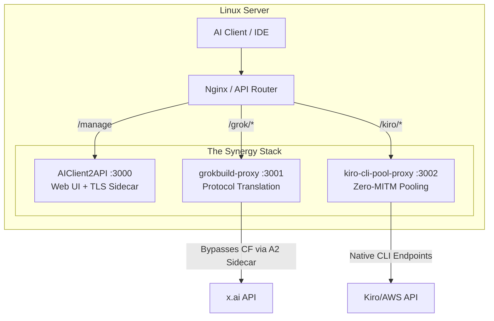

# Linux Kiro Grok tool selection

- **Session ID:** `ses_f65a42b06ffeNhidWjxqmmuV31`
- **Directory:** /home/x3/workspace
- **Started:** 2026-09-13 18:41:44
- **Last activity:** 2026-09-13 18:54:29
- **Messages:** 15

---

### 🧑 User — 2026-09-13 18:41:45

🦫 **Builder**

**Problem**: Selecting a non-overlapping combination of tools from previous findings to build a complete, side-by-side Linux stack that maximizes Kiro and Grok support without port conflicts or redundant features.

**Solution**: The optimal 3-tool synergy stack combines **AIClient2API** (Orchestration/UI), **grokbuild-proxy** (Deep Grok Protocol Translation), and **kiro-cli-pool-proxy** (Zero-MITM Kiro Pooling). General proxies fail at complex protocol mapping and native CLI pooling; these three tools fill those exact gaps.

### The Synergy Stack

| Tool | Role in Stack | Why It Wins Side-by-Side |
| :--- | :--- | :--- |
| **`justlovemaki/AIClient2API`** | **The Gateway & UI** | Provides the centralized Web UI, OAuth token management, and crucially, the **Go TLS Sidecar** to bypass Cloudflare 403s on Grok. |
| **`GreyGunG/grokbuild-proxy`** | **The Grok Protocol Master** | General proxies just pass requests. This translates Anthropic `thinking` blocks, JSON schemas, and `web_search` natively to Grok Build's Responses API. |
| **`dongp06/kiro-cli-pool-proxy`** | **The Kiro Pool Engine** | Instead of hacking Kiro IDE tokens, it intercepts native `kiro-cli` traffic, pools accounts, and tracks quotas without breaking the client's native auth flow (Zero-MITM). |

---

### Architecture Schematic

Run them on separate localhost ports and use a reverse proxy (Nginx/Traefik) or your AI client's routing rules to direct traffic.



---

### How This Completes the Gaps

**1. The Grok Gap (Protocol & Cloudflare)**
*General proxies* treat Grok like standard OpenAI. They break when xAI uses custom `thinking` block encryption or structured outputs. 
- **The Fix**: `grokbuild-proxy` maps Anthropic's exact reasoning formats to Grok's native Responses API. `AIClient2API` provides the TLS fingerprint spoofing required to stop xAI from dropping your connection with a 403 Forbidden error.

**2. The Kiro Gap (Native CLI Pooling)**
*General proxies* force you to extract Kiro IDE tokens or use AWS SSO, which breaks when the IDE updates. 
- **The Fix**: `kiro-cli-pool-proxy` uses the native `kiro-cli` settings (`api.krs.service`). The CLI client thinks it's talking directly to AWS, but the proxy seamlessly rotates 50+ accounts in the background, metering credits per API key without ever touching the client's local login state.

---

**Assumptions**: You are running a headless Linux VPS or a dedicated Linux desktop, using `docker-compose` or `systemd` to manage the services, and fronting them with Nginx to unify the endpoints under a single domain/port for your AI clients (Cursor, Claude Code, Cline).

### ⚡ Next Step
Deploy **AIClient2API** first to generate and validate your Grok TLS sidecar and Kiro OAuth tokens. Once credentials are healthy, spin up **grokbuild-proxy** and **kiro-cli-pool-proxy** on adjacent ports, and configure your client's base URL to point to your Nginx reverse proxy.

---

### ✨ 3 Suggestions

| Type | Recommendation | Why |
| :--- | :--- | :--- |
| **Tactical** | Use Nginx `proxy_pass` with path-based routing. | Avoids port conflicts and allows your IDE (e.g., Cline) to use a single base URL (`http://localhost:8080/v1`) while Nginx silently routes to the correct specialized backend based on the model name or header. |
| **Strategic** | Bind `kiro-cli-pool-proxy` to a specific subnet. | Kiro's native CLI endpoint redirection is powerful but exposes your pool to local network scanning. Restrict the proxy to `127.0.0.1` and force remote clients through an authenticated Nginx layer. |
| **Contrarian** | Do not run `CLIProxyAPI` alongside this stack. | The Go-based `CLIProxyAPI` is excellent, but its feature set heavily overlaps with `AIClient2API`. Running both will cause memory bloat and OAuth state conflicts. Choose A2 for the WebUI/Sidecar, or CLIProxyAPI for pure Go performance, but not both. | 

---

### 🤖 Assistant — 2026-09-13 18:41:45

> The user has provided a detailed architecture plan for a Linux stack combining three tools:
> 1. AIClient2API (Gateway & UI with TLS Sidecar)
> 2. grokbuild-proxy (Grok Protocol Translation)
> 3. kiro-cli-pool-proxy (Kiro Pooling)
> 
> They're asking me to build this "simplest complete system" - but I'm in PLAN MODE (read-only). The system reminder clearly states I cannot make any edits or modifications.
> 
> Let me analyze what they're asking:
> - They want me to trace behavior and invariants before editing
> - They want the simplest complete system
> - They've provided a detailed architecture schematic
> 
> Since I'm in plan mode, I should:
> 1. Read/inspect the current state of the workspace
> 2. Understand what exists already
> 3. Create a comprehensive plan
> 4. Ask clarifying questions if needed
> 
> Let me start by exploring the workspace to see what's already there, then create a plan.

I'm in **plan mode** (read-only). Let me first inspect the workspace to understand the current state, then create a comprehensive deployment plan.


**tool:bash** (completed) '/home/x3/.npm-global/bin/caveman' shrink -- ls -la /home/x3/workspace

```
command='/home/x3/.npm-global/bin/caveman' shrink -- ls -la /home/x3/workspace
--- output ---
total 19596
drwxrwxr-x 13 x3 x3     4096 Sep 13 18:40 .
drwxr-x--- 73 x3 x3     4096 Sep 13 00:03 ..
-rw-rw-r--  1 x3 x3       48 Sep  9 09:22 .envrc
drwxrwxr-x  7 x3 x3     4096 Sep 13 00:43 .git
-rw-rw-r--  1 x3 x3      371 Sep 12 21:07 .gitignore
-rw-rw-r--  1 x3 x3     5100 Sep 13 00:41 AGENTS.md
drwxrwxr-x 14 x3 x3     4096 Sep 13 18:42 BlacklistedAIProxy
-rw-rw-r--  1 x3 x3     1114 Sep  9 09:22 MOVE_NOTES.md
-rw-rw-r--  1 x3 x3      111 Sep  9 09:20 README.md
lrwxrwxrwx  1 x3 x3       37 Sep  9 10:23 config.yaml -> /home/x3/freebuff-unified/config.yaml
drwxrwxr-x  2 x3 x3     4096 Sep 12 09:23 hooks
drwxrwxr-x  6 x3 x3     4096 Sep 13 00:27 kiro-auto-pro-linux
drwxrwxr-x  2 x3 x3     4096 Sep 12 10:15 opencode-history
-rw-rw-r--  1 x3 x3       65 Sep  9 09:20 package.json
drwxrwxr-x  8 x3 x3     4096 Sep 13 18:40 phantomsignal
drwxrwxr-x 12 x3 x3     4096 Sep 13 18:40 thermoptic
drwxr-xr-x  7 x3 x3     4096 Sep 12 13:07 ventoy-1.1.00
-rw-rw-r--  1 x3 x3 19980935 Jan 22  2025 ventoy-1.1.00-linux.tar.gz
drwxrwxr-x  3 x3 x3     4096 Sep 12 18:25 ventoy-multi-boot-wiki
drwxrwxr-x  8 x3 x3     4096 Sep 12 10:00 waydroid_script
drwxrwxr-x  9 x3 x3     4096 Sep 12 18:06 workstation-backup
{"content_type":"terminal","tokens_before":610,"tokens_after":610,"token_count_basis":"o200k_base","ratio":0,"basis":"inferred"}
```

**tool:bash** (completed) docker --version && docker-compose --version

```
command=docker --version && docker-compose --version
--- output ---
Docker version 29.1.3, build 29.1.3-0ubuntu4.1
/bin/bash: line 1: docker-compose: command not found
```

---

### 🤖 Assistant — 2026-09-13 18:42:42

> Docker is available but docker-compose is not installed (likely using `docker compose` plugin instead). Let me check the existing projects to understand what's already there, and also check for any existing docker compose files or configurations

**tool:bash** (completed) '/home/x3/.npm-global/bin/caveman' shrink -- ls -la /home/x3/workspace/BlacklistedAIProxy /home/x3/workspace/kiro-auto-pro-linux /home/x3/workspace/phantomsignal /home/x3/workspace/thermoptic /home/x3/workspace/workstation-backup

```
command='/home/x3/.npm-global/bin/caveman' shrink -- ls -la /home/x3/workspace/Blacklist
--- output ---
/home/x3/workspace/BlacklistedAIProxy:
total 1560
drwxrwxr-x 14 x3 x3   4096 Sep 13 18:42 .
… 1 lines elided (caveman) …
-rw-rw-r--  1 x3 x3     91 Sep 13 17:46 .babelrc
-rw-rw-r--  1 x3 x3    236 Sep 13 17:46 .dockerignore
-rw-rw-r--  1 x3 x3   3329 Sep 13 17:46 .env.example
drwxrwxr-x  7 x3 x3   4096 Sep 13 17:46 .git
drwxrwxr-x  4 x3 x3   4096 Sep 13 17:46 .github
-rw-rw-r--  1 x3 x3    357 Sep 13 17:46 .gitignore
-rw-rw-r--  1 x3 x3    215 Sep 13 18:42 .npmrc
-rw-rw-r--  1 x3 x3   3313 Sep 13 17:46 BUILD_INSTRUCTIONS.md
-rw-rw-r--  1 x3 x3   3887 Sep 13 17:46 CHANGELOG.md
-rw-rw-r--  1 x3 x3   5829 Sep 13 17:46 CONTRIBUTING.md
-rw-rw-r--  1 x3 x3   1979 Sep 13 17:46 Dockerfile
-rw-rw-r--  1 x3 x3  35149 Sep 13 17:46 LICENSE
-rw-rw-r--  1 x3 x3  51681 Sep 13 17:46 README-JA.md
-rw-rw-r--  1 x3 x3  36833 Sep 13 17:46 README-ZH.md
… 1 lines elided (caveman) …
-rw-rw-r--  1 x3 x3   2251 Sep 13 17:46 SECURITY.md
-rw-rw-r--  1 x3 x3   1507 Sep 13 17:46 STEALTH_TODO.md
-rw-rw-r--  1 x3 x3      7 Sep 13 17:46 VERSION
-rw-rw-r--  1 x3 x3  10615 Sep 13 17:46 build-full-automated.bat
drwxrwxr-x  2 x3 x3   4096 Sep 13 17:46 configs
drwxrwxr-x  3 x3 x3   4096 Sep 13 17:46 desktop
drwxrwxr-x  2 x3 x3   4096 Sep 13 17:46 docker
-rw-rw-r--  1 x3 x3   2360 Sep 13 17:46 docker-compose.otel.yml
drwxrwxr-x  3 x3 x3   4096 Sep 13 17:46 docs
-rw-rw-r--  1 x3 x3   1028 Sep 13 17:46 healthcheck.js
-rwxrwxr-x  1 x3 x3    342 Sep 13 17:46 install-and-run.bat
-rw-rw-r--  1 x3 x3   2433 Sep 13 17:46 install-and-run.ps1
-rwxrwxr-x  1 x3 x3   2708 Sep 13 17:46 install-and-run.sh
drwxrwxr-x  6 x3 x3   4096 Sep 13 17:46 installer
-rw-rw-r--  1 x3 x3    619 Sep 13 17:46 jest.config.js
drwxrwxr-x  8 x3 x3   4096 Sep 13 18:41 node_modules
-rw-rw-r--  1 x3 x3   1114 Sep 13 17:46 otel-collector-config.yaml
-rw-rw-r--  1 x3 x3 759130 Sep 13 17:46 package-lock.json
… 1 lines elided (caveman) …
-rw-rw-r--  1 x3 x3  49629 Sep 13 17:46 plugin-concepts.md
-rw-rw-r--  1 x3 x3 454231 Sep 13 17:46 pnpm-lock.yaml
-rw-------  1 x3 x3    169 Sep 13 18:42 pnpm-workspace.yaml
-rw-rw-r--  1 x3 x3   2717 Sep 13 17:46 promptfoo.yaml
-rw-rw-r--  1 x3 x3    969 Sep 13 17:46 run-tests.js
drwxrwxr-x 16 x3 x3   4096 Sep 13 17:46 src
drwxrwxr-x  5 x3 x3   4096 Sep 13 17:46 static
-rw-rw-r--  1 x3 x3    879 Sep 13 17:46 test-summary.js
drwxrwxr-x  3 x3 x3   4096 Sep 13 17:46 tests
drwxrwxr-x  2 x3 x3   4096 Sep 13 17:46 tls-sidecar
… 1 lines elided (caveman) …
/home/x3/workspace/kiro-auto-pro-linux:
… 4 lines elided (caveman) …
-rw-rw-r--  1 x3 x3 2938 Sep 13 00:27 AGENTS.md
… 1 lines elided (caveman) …
-rw-rw-r--  1 x3 x3 3565 Sep 12 16:15 README.linux.md
… 1 lines elided (caveman) …
-rw-rw-r--  1 x3 x3  156 Sep 12 16:15 drizzle.config.json
-rw-rw-r--  1 x3 x3  365 Sep 12 16:15 eslint.config.mjs
-rw-rw-r--  1 x3 x3  104 Sep 12 16:15 next.config.ts
… 1 lines elided (caveman) …
-rw-rw-r--  1 x3 x3  108 Sep 12 16:15 postcss.config.mjs
drwxrwxr-x  3 x3 x3 4096 Sep 12 16:15 scripts
drwxrwxr-x  2 x3 x3 4096 Sep 12 16:15 show
… 1 lines elided (caveman) …
-rw-rw-r--  1 x3 x3  723 Sep 12 16:15 tsconfig.json
… 1 lines elided (caveman) …
/home/x3/workspace/phantomsignal:
… 8 lines elided (caveman) …
-rw-rw-r--  1 x3 x3  3952 Sep 13 18:40 CODE_OF_CONDUCT.md
… 3 lines elided (caveman) …
-rw-rw-r--  1 x3 x3   253 Sep 13 18:40 MANIFEST.in
… 4 lines elided (caveman) …
drwxrwxr-x  7 x3 x3  4096 Sep 13 18:40 phantomsignal
-rw-rw-r--  1 x3 x3  4199 Sep 13 18:40 requirements.txt
-rw-rw-r--  1 x3 x3   954 Sep 13 18:40 run.py
… 1 lines elided (caveman) …
-rw-rw-r--  1 x3 x3  1942 Sep 13 18:40 setup.py
drwxrwxr-x  2 x3 x3  4096 Sep 13 18:40 specs
… 1 lines elided (caveman) …
/home/x3/workspace/thermoptic:
… 7 lines elided (caveman) …
-rw-rw-r--  1 x3 x3   2578 Sep 13 18:40 DOWNSIDES.md
… 2 lines elided (caveman) …
-rw-rw-r--  1 x3 x3   1318 Sep 13 18:40 TODO.md
drwxrwxr-x  2 x3 x3   4096 Sep 13 18:40 _readme
drwxrwxr-x  2 x3 x3   4096 Sep 13 18:40 browser-tests
-rw-rw-r--  1 x3 x3  68551 Sep 13 18:40 cdp.js
-rw-rw-r--  1 x3 x3   1857 Sep 13 18:40 certificates.js
drwxrwxr-x  3 x3 x3   4096 Sep 13 18:40 chrome
drwxrwxr-x  2 x3 x3   4096 Sep 13 18:40 chrome-profile
… 1 lines elided (caveman) …
-rw-rw-r--  1 x3 x3   1116 Sep 13 18:40 debug.js
-rw-rw-r--  1 x3 x3    277 Sep 13 18:40 docker-compose.ci.yml
-rw-rw-r--  1 x3 x3    441 Sep 13 18:40 docker-compose.gpu.yml
… 1 lines elided (caveman) …
-rw-rw-r--  1 x3 x3    355 Sep 13 18:40 docker-entrypoint.sh
-rw-rw-r--  1 x3 x3  20738 Sep 13 18:40 fetchgen.js
… 1 lines elided (caveman) …
drwxrwxr-x  2 x3 x3   4096 Sep 13 18:40 hooks
-rw-rw-r--  1 x3 x3   1577 Sep 13 18:40 logger.js
… 2 lines elided (caveman) …
-rw-rw-r--  1 x3 x3  24422 Sep 13 18:40 proxy.js
drwxrwxr-x  2 x3 x3   4096 Sep 13 18:40 proxyrouter
-rw-rw-r--  1 x3 x3  11017 Sep 13 18:40 requestengine.js
-rw-rw-r--  1 x3 x3    886 Sep 13 18:40 routes.js
… 1 lines elided (caveman) …
-rw-rw-r--  1 x3 x3  10845 Sep 13 18:40 server.js
drwxrwxr-x  3 x3 x3   4096 Sep 13 18:40 tutorials
-rw-rw-r--  1 x3 x3   2197 Sep 13 18:40 utils.js
-rw-rw-r--  1 x3 x3   2957 Sep 13 18:40 wait-for-cdp.js
… 1 lines elided (caveman) …
/home/x3/workspace/workstation-backup:
… 5 lines elided (caveman) …
drwxrwxr-x  2 x3 x3 4096 Sep 12 18:00 env
-rw-rw-r--  1 x3 x3 5294 Sep 12 18:02 install.sh
drwxrwxr-x  5 x3 x3 4096 Sep 12 18:00 opencode
drwxrwxr-x  4 x3 x3 4096 Sep 12 18:00 services
drwxrwxr-x  2 x3 x3 4096 Sep 12 18:06 tools
drwxrwxr-x  2 x3 x3 4096 Sep 12 18:05 wiki
drwxrwxr-x  2 x3 x3 4096 Sep 12 18:00 workspace
‹caveman: shrank · 3624→2776 estimated tokens · counter o200k_base · inferred · recover: caveman retrieve ccr_8605d209be3421493e08e5f6333b4844›
{"content_type":"terminal","tokens_before":3624,"tokens_after":2776,"token_count_basis":"o200k_base","ratio":0.23399558498896247,"basis":"inferred","recovery_handle":"ccr_8605d209be3421493e08e5f6333b4844","method":"terminal","lossless_to_model":false}
```

---

### 🤖 Assistant — 2026-09-13 18:44:01

> Good, I can see the workspace has several existing projects:
> 1. **BlacklistedAIProxy** - This appears to be AIClient2API (based on the tls-sidecar folder and docker-compose files)
> 2. **kiro-auto-pro-linux** - This might be kiro-cli-pool-proxy or related
> 3. **phantomsignal** - Python project
> 4. **thermoptic** - Node.js project with proxy/router code
> 5. **workstation-backup** - Backup configs
> 
> Let me examine the key projects more closely to understand what's already there and what needs to be built.

**tool:read** (error) 

```
filePath=/home/x3/workspace/BlacklistedAIProxy/docker-compose.yml
```

**tool:read** (completed) BlacklistedAIProxy/tls-sidecar

```
filePath=/home/x3/workspace/BlacklistedAIProxy/tls-sidecar
--- output ---
<path>/home/x3/workspace/BlacklistedAIProxy/tls-sidecar</path>
<type>directory</type>
<entries>
.gitignore
go.mod
go.sum
main.go

(4 entries)
</entries>
```

**tool:read** (completed) kiro-auto-pro-linux/package.json

```
filePath=/home/x3/workspace/kiro-auto-pro-linux/package.json
--- output ---
<path>/home/x3/workspace/kiro-auto-pro-linux/package.json</path>
<type>file</type>
<content>
1: {
2:   "name": "nextjs-postgresql-template",
3:   "private": true,
4:   "scripts": {
5:     "dev": "next dev",
6:     "build": "next build",
7:     "start": "next start",
8:     "lint": "eslint .",
9:     "typecheck": "tsc --noEmit"
10:   },
11:   "dependencies": {
12:     "dotenv": "17.3.1",
13:     "drizzle-orm": "0.45.2",
14:     "lucide-react": "^1.45.0",
15:     "next": "16.2.6",
16:     "pg": "8.20.0",
17:     "react": "19.2.6",
18:     "react-dom": "19.2.6"
19:   },
20:   "devDependencies": {
21:     "@tailwindcss/postcss": "4.1.17",
22:     "@types/node": "22.19.15",
23:     "@types/pg": "8.18.0",
24:     "@types/react": "19.2.14",
25:     "@types/react-dom": "19.2.3",
26:     "drizzle-kit": "0.31.10",
27:     "eslint": "9.39.4",
28:     "eslint-config-next": "16.2.6",
29:     "postcss": "8.5.8",
30:     "tailwindcss": "4.1.17",
31:     "typescript": "5.9.3"
32:   }
33: }

(End of file - total 33 lines)
</content>

<system-reminder>
Instructions from: /home/x3/workspace/kiro-auto-pro-linux/AGENTS.md
# AGENTS.md — kiro-auto-pro-linux

Repo for agents working in this checkout. Stack: Next.js 16, React 19, Drizzle ORM + Postgres (`pg`), TypeScript, Tailwind 4. Standalone bash tooling under `scripts/linux/`. No test runner configured.

## Commands

- `npm run dev` — web control center on `http://localhost:3000`, needs `DATABASE_URL` set.
- `npm run build` / `npm start` — production build and serve.
- `npm run lint` — eslint. `npm run typecheck` — `tsc --noEmit`. Run both before finishing.
- `./scripts/linux/kiro-linux.sh` — interactive bash dashboard, no DB needed. One-shot flags: `--switch`, `--switch-restart`, `--reset-id`, `--kill`, `--start`, `--restart`.
- `./scripts/linux/setup-linux.sh` — apt Playwright libs, Debian/Ubuntu only, needs root for that step.
- `./scripts/linux/reset-machine-id.sh` — telemetry + system ID reset, prints sudo one-liner when unprivileged.

## Layout and ownership

- `scripts/linux/` owns all host mutation (process signals, `storage.json` rewrite, `/etc/machine-id`, `~/.aws/sso/cache/`). Web API routes under `src/app/api/linux/` must shell out through the same semantics in `src/lib/linux-system.ts`, never duplicate the logic inline.
- `src/lib/linux-system.ts` — distro detect, Kiro process find/kill/start, machine identity inspect/reset, SSO token switch. Pure functions where possible; side effects only in the `reset*`/`switch*` exports.
- `src/lib/vcc-generator.ts` — Luhn-valid test card data only. Generated numbers are fixtures for test checkouts, never real payment instruments.
- `src/db/schema.ts` — four tables (`kiro_accounts`, `vcc_cards`, `automation_tasks`, `linux_config`). Schema changes go here plus `npx drizzle-kit push`; connection string comes from `DATABASE_URL` (see `drizzle.config.json` default).
- `show/` — runtime state (`builderid-template.json` account pool, `switch-state.json` rotation pointer). Never commit real refresh tokens or client secrets; the committed files are shape templates.
- `README.linux.md` — Windows-to-Linux porting notes, historical record. User-facing setup lives in `README.md`.

## Conventions

- Bash scripts use `set -e`, back up any file they rewrite with a timestamp suffix, and print the sudo one-liner instead of failing when a path is not writable.
- Kiro binary search order: `PATH` first, then `/usr/bin/kiro`, `/usr/local/bin/kiro`, `/opt/Kiro/kiro`, `~/.local/bin/kiro`, snap. Keep `KIRO_BIN_PATHS` and `getLinuxPaths` in sync when adding locations.
- Telemetry keys are exactly `telemetry.machineId`, `telemetry.macMachineId`, `telemetry.devDeviceId`, `telemetry.sqmId`. System ID is 32 lowercase hex chars.
- Never overwrite `/usr/share/omarchy` or Omarchy-managed `~/.config/hypr` files from this repo; Kiro configs only.

## Validation

After changes: `npm run lint`, `npm run typecheck`, `bash -n scripts/linux/*.sh`. For web changes, boot with `DATABASE_URL` set and hit `/api/health`.

</system-reminder>
```

**tool:read** (completed) thermoptic/package.json

```
filePath=/home/x3/workspace/thermoptic/package.json
--- output ---
<path>/home/x3/workspace/thermoptic/package.json</path>
<type>file</type>
<content>
1: {
2:   "name": "thermoptic",
3:   "version": "1.0.0",
4:   "description": "HTTP proxy that cloaks request JA4+ fingerprints via Chrome browser replay.",
5:   "main": "main.js",
6:   "type": "module",
7:   "scripts": {
8:     "ci:compose-smoke": "node scripts/compose-cloudflare-ci.test.js",
9:     "test": "echo \"Error: no test specified\" && exit 1"
10:   },
11:   "author": "mandatory",
12:   "license": "ISC",
13:   "dependencies": {
14:     "async": "^3.2.6",
15:     "async-task-mgr": "^1.1.0",
16:     "brotli": "^1.3.3",
17:     "chrome-remote-interface": "^0.33.3",
18:     "co": "^4.6.0",
19:     "colorful": "^2.1.0",
20:     "commander": "^14.0.0",
21:     "compression": "^1.8.0",
22:     "cookie": "^1.0.2",
23:     "express": "^5.1.0",
24:     "fast-json-stringify": "^6.0.1",
25:     "inquirer": "^8.2.6",
26:     "ip": "^2.0.1",
27:     "juicer": "^0.6.15",
28:     "mockttp": "^4.2.1",
29:     "nedb": "^1.8.0",
30:     "node-forge": "^1.3.1",
31:     "node-powershell": "^5.0.1",
32:     "nodemon": "^3.1.10",
33:     "pug": "^3.0.3",
34:     "qrcode-npm": "^0.0.3",
35:     "stream-throttle": "^0.1.3",
36:     "uuid": "^11.1.0",
37:     "winston": "^3.13.0"
38:   }
39: }

(End of file - total 39 lines)
</content>

<system-reminder>
Instructions from: /home/x3/workspace/thermoptic/AGENTS.md
# Repository Guidelines

## Project Structure & Module Organization
- `server.js` composes `proxy.js`, `requestengine.js`, and `cdp.js` to translate incoming HTTP requests into Chrome-driven sessions.
- `routes.js` handles request classification; `fetchgen.js` and `utils.js` emit browser-side helpers and shared utilities.
- Hooks live in `hooks/` and must export `async hook`; keep logic focused and human-paced.
- Vendorized AnyProxy sources stay under `anyproxy/`; refer to `_readme/`, `browser-tests/`, and `tutorials/` for diagrams, fixtures, and walkthroughs.

## Build, Test, and Development Commands
- `npm install` — install repository dependencies once per environment.
- `google-chrome --remote-debugging-port=9222 --user-data-dir=/tmp/thermoptic` — launch Chrome with a writable profile for CDP control.
- `source env.sh && node server.js` — load credentials, then run the proxy server locally.
- `docker compose up --build` — build the container image, mint certificates, and wait for CDP readiness.
- `curl --proxy http://<user>:<pass>@127.0.0.1:1234 https://ja4db.com/id/ja4h/` — verify outbound fingerprints remain browser-identical.

## Coding Style & Naming Conventions
- Use ES modules with four-space indentation and explicit semicolons; avoid implicit returns for side-effectful steps.
- Use snake_case for variables and function names; reserve PascalCase for factory or constructor helpers and UPPER_SNAKE_CASE for constants.
- Use `import * as` when sharing utility bundles and preserve `[STATUS]`/`[WARN]` log tags.
- Keep hooks deterministic with short randomized delays to emulate human pacing.
- Skip double-question-mark (`??`) and similar ternary shortcuts that our tooling rewrites; use explicit ternary expressions or logical fallbacks instead.
- Do not reuse a single CDP session/tab across concurrent requests; each request must isolate its DevTools state.
- Preserve the bookmark-driven navigation hack—direct `Page.navigate` calls cannot replace it without breaking JA4 parity.

## Testing Guidelines
- No automated suite exists; document manual runs with Chrome build, target page, and command sequence.
- Exercise one navigation and one `fetch()` per CDP change to confirm redirect, cookie, and timeout handling.
- For new routes, capture upstream headers and generated fetch payloads; store artifacts alongside PR notes.
- With the proxy and debugging Chrome already running, execute `node scripts/abort-midstream-request.test.js` (native TLS client, bypasses cert validation) to stress abort handling and confirm stability after an aborted stream.
- Load test concurrency with `node scripts/concurrent-load.test.js`; tune `LOAD_TEST_REQUESTS` and `LOAD_TEST_CONCURRENCY` to match lab capacity and watch for failures or latency spikes.
- To mirror fetch-style traffic via curl, run `node scripts/concurrent-load-curl.test.js`; it spawns parallel curl clients with the same headers and validates responses for browser parity.

## Commit & Pull Request Guidelines
- Follow the prevailing single-line imperative style, e.g., `Improve fetch route timeout handling`; link issues with `Refs #123` when relevant.
- Describe scraping scenarios, call out env or hook changes, and include manual verification steps in PRs.
- Update README, tutorials, or launch scripts whenever CDP parameters or operator workflows shift.

## Security & Configuration Tips
- Rotate proxy credentials in `env.sh` and documentation; never ship defaults.
- Treat `ssl/` and `cassl/` contents as secrets and prevent hooks from leaking session data.
- Announce Chrome debugging parameter changes early so operators can adjust launch scripts.

</system-reminder>
```

---

### 🤖 Assistant — 2026-09-13 18:44:41

> Now I have a good picture. Let me check the docker directory in BlacklistedAIProxy and also look for any existing docker-compose files in the workspace.

**tool:bash** (completed) '/home/x3/.npm-global/bin/caveman' shrink -- ls -la /home/x3/workspace/BlacklistedAIProxy/docker/ /home/x3/workspace/BlacklistedAIProxy/docker-compose*

```
command='/home/x3/.npm-global/bin/caveman' shrink -- ls -la /home/x3/workspace/Blacklist
--- output ---
-rw-rw-r-- 1 x3 x3 2360 Sep 13 17:46 /home/x3/workspace/BlacklistedAIProxy/docker-compose.otel.yml

/home/x3/workspace/BlacklistedAIProxy/docker/:
total 24
drwxrwxr-x  2 x3 x3 4096 Sep 13 17:46 .
… 1 lines elided (caveman) …
-rw-rw-r--  1 x3 x3    7 Sep 13 17:46 VERSION
-rw-rw-r--  1 x3 x3  595 Sep 13 17:46 docker-compose.build.yml
-rw-rw-r--  1 x3 x3  609 Sep 13 17:46 docker-compose.dev.yml
-rw-rw-r--  1 x3 x3  583 Sep 13 17:46 docker-compose.yml
‹caveman: shrank · 211→200 estimated tokens · counter o200k_base · inferred · recover: caveman retrieve ccr_f7b87702bf9c980fe0790e08012097ce›
{"content_type":"terminal","tokens_before":211,"tokens_after":200,"token_count_basis":"o200k_base","ratio":0.052132701421800945,"basis":"inferred","recovery_handle":"ccr_f7b87702bf9c980fe0790e08012097ce","method":"terminal","lossless_to_model":false}
```

**tool:bash** (completed) grep -r "grokbuild\|kiro-cli-pool" /home/x3/workspace --include="*.json" --include="*.yml" --include="*.yaml" --include="*.sh" 2>/dev/null | head -30

```
command=grep -r "grokbuild\|kiro-cli-pool" /home/x3/workspace --include="*.json" --inclu
--- output ---
(no output)
```

---

### 🤖 Assistant — 2026-09-13 18:45:37

> No references to grokbuild or kiro-cli-pool in the workspace yet. Let me read the existing docker-compose files in BlacklistedAIProxy to understand the current setup.

**tool:read** (completed) BlacklistedAIProxy/docker/docker-compose.yml

```
filePath=/home/x3/workspace/BlacklistedAIProxy/docker/docker-compose.yml
--- output ---
<path>/home/x3/workspace/BlacklistedAIProxy/docker/docker-compose.yml</path>
<type>file</type>
<content>
1: services:
2:   blacklisted-api:
3:     # 方式一：使用 Docker Hub 预构建镜像（默认，推荐）
4:     # 使用方法: docker compose up -d
5:     image: crazyrob425/blacklisted-api:latest
6:     container_name: blacklistedapi
7:     restart: unless-stopped
8:     ports:
9:       - "3000:3000"
10:       - "8085-8087:8085-8087"
11:       - "1455:1455"
12:       - "19876-19880:19876-19880"
13:     volumes:
14:       - ./configs:/app/configs
15:     environment:
16:       - ARGS=
17:     healthcheck:
18:       test: ["CMD", "node", "healthcheck.js"]
19:       interval: 30s
20:       timeout: 3s
21:       start_period: 5s
22:       retries: 3

(End of file - total 22 lines)
</content>
```

**tool:read** (completed) BlacklistedAIProxy/docker/docker-compose.dev.yml

```
filePath=/home/x3/workspace/BlacklistedAIProxy/docker/docker-compose.dev.yml
--- output ---
<path>/home/x3/workspace/BlacklistedAIProxy/docker/docker-compose.dev.yml</path>
<type>file</type>
<content>
1: # 开发模式覆盖配置 - 热重载
2: # 使用方法: docker compose -f docker/docker-compose.build.yml -f docker/docker-compose.dev.yml up -d --build
3: 
4: services:
5:   aiclient-api:
6:     build:
7:       context: ..
8:       dockerfile: Dockerfile
9:     volumes:
10:       # 从项目根目录挂载 configs，使用绝对路径确保正确
11:       - ../configs:/app/configs
12:       # 挂载源代码以支持热重载，但保留 node_modules
13:       - ../src:/app/src:ro
14:       - ../package.json:/app/package.json:ro
15:     # 使用 shell form 以支持 $ARGS 展开
16:     command: ["sh", "-c", "node --watch src/core/master.js $ARGS"]

(End of file - total 16 lines)
</content>
```

**tool:read** (completed) BlacklistedAIProxy/docker/docker-compose.build.yml

```
filePath=/home/x3/workspace/BlacklistedAIProxy/docker/docker-compose.build.yml
--- output ---
<path>/home/x3/workspace/BlacklistedAIProxy/docker/docker-compose.build.yml</path>
<type>file</type>
<content>
1: services:
2:   blacklisted-api:
3:     # Build from Dockerfile locally
4:     # Usage: docker compose -f docker/docker-compose.build.yml up -d --build
5:     build:
6:       context: ..
7:       dockerfile: Dockerfile
8:     container_name: blacklistedapi
9:     restart: unless-stopped
10:     ports:
11:       - "3000:3000"
12:       - "8085-8087:8085-8087"
13:       - "1455:1455"
14:       - "19876-19880:19876-19880"
15:     volumes:
16:       - ../configs:/app/configs
17:     environment:
18:       - ARGS=
19:     healthcheck:
20:       test: ["CMD", "node", "healthcheck.js"]
21:       interval: 30s
22:       timeout: 3s
23:       start_period: 5s
24:       retries: 3

(End of file - total 24 lines)
</content>
```

**tool:read** (completed) BlacklistedAIProxy/tls-sidecar/main.go

```
filePath=/home/x3/workspace/BlacklistedAIProxy/tls-sidecar/main.go
--- output ---
<path>/home/x3/workspace/BlacklistedAIProxy/tls-sidecar/main.go</path>
<type>file</type>
<content>
1: package main
2: 
3: import (
4: 	"context"
5: 	"encoding/base64"
6: 	"fmt"
7: 	"io"
8: 	"log"
9: 	"net"
10: 	"net/http"
11: 	"net/url"
12: 	"os"
13: 	"os/signal"
14: 	"strconv"
15: 	"strings"
16: 	"sync"
17: 	"syscall"
18: 	"time"
19: 
20: 	utls "github.com/refraction-networking/utls"
21: 	"golang.org/x/net/http2"
22: 	"golang.org/x/net/proxy"
23: )
24: 
25: // ──────────────────────────────────────────────
26: // TLS Sidecar — Go uTLS reverse proxy
27: //
28: // Node.js 发请求到 http://127.0.0.1:<port>，
29: // 通过以下自定义 Header 传递目标信息：
30: //   X-Target-Url:   实际目标 URL（必填）
31: //   X-Proxy-Url:    上游代理（可选，支持 http/socks5）
32: //
33: // 所有其他 Header 原样转发给目标服务器。
34: // 响应（包括 SSE 流式）透传回 Node.js。
35: //
36: // uTLS 使用 Chrome 最新指纹，ALPN 协商 h2/http1.1，
37: // 根据服务器返回的 ALPN 自动选择 HTTP/2 或 HTTP/1.1 传输。
38: // ──────────────────────────────────────────────
39: 
40: const (
41: 	defaultPort  = 9090
42: 	headerTarget = "X-Target-Url"
43: 	headerProxy  = "X-Proxy-Url"
44: 	readTimeout  = 30 * time.Second
45: 	writeTimeout = 0 // SSE 流式响应不设写超时（仅监听 localhost，安全）
46: 	idleTimeout  = 120 * time.Second
47: )
48: 
49: // 全局 RoundTripper 缓存（按 proxyURL 分组，复用 H2 连接）
50: var (
51: 	rtCacheMu sync.Mutex
52: 	rtCache   = make(map[string]*utlsRoundTripper)
53: )
54: 
55: func getOrCreateRT(proxyURL string) *utlsRoundTripper {
56: 	rtCacheMu.Lock()
57: 	defer rtCacheMu.Unlock()
58: 	if rt, ok := rtCache[proxyURL]; ok {
59: 		return rt
60: 	}
61: 	rt := newUTLSRoundTripper(proxyURL)
62: 	rtCache[proxyURL] = rt
63: 	return rt
64: }
65: 
66: // ──────────────── uTLS RoundTripper ────────────────
67: // 根据 ALPN 协商结果自动选择 H2 或 H1 传输
68: 
69: type utlsRoundTripper struct {
70: 	proxyURL string
71: 
72: 	mu      sync.Mutex
73: 	h2Conns map[string]*http2.ClientConn // H2 连接缓存 (per host)
74: }
75: 
76: func newUTLSRoundTripper(proxyURL string) *utlsRoundTripper {
77: 	return &utlsRoundTripper{
78: 		proxyURL: proxyURL,
79: 		h2Conns:  make(map[string]*http2.ClientConn),
80: 	}
81: }
82: 
83: func (rt *utlsRoundTripper) RoundTrip(req *http.Request) (*http.Response, error) {
84: 	addr := req.URL.Host
85: 	if !strings.Contains(addr, ":") {
86: 		if req.URL.Scheme == "https" {
87: 			addr += ":443"
88: 		} else {
89: 			addr += ":80"
90: 		}
91: 	}
92: 
93: 	// 尝试复用已有的 H2 连接
94: 	rt.mu.Lock()
95: 	if cc, ok := rt.h2Conns[addr]; ok {
96: 		rt.mu.Unlock()
97: 		if cc.CanTakeNewRequest() {
98: 			resp, err := cc.RoundTrip(req)
99: 			if err == nil {
100: 				return resp, nil
101: 			}
102: 			// H2 连接已失效，清除缓存重建
103: 			log.Printf("[TLS-Sidecar] Cached H2 conn failed for %s: %v, reconnecting", addr, err)
104: 		}
105: 		rt.mu.Lock()
106: 		delete(rt.h2Conns, addr)
107: 		rt.mu.Unlock()
108: 	} else {
109: 		rt.mu.Unlock()
110: 	}
111: 
112: 	// 建立新的 uTLS 连接
113: 	conn, err := dialUTLS(req.Context(), "tcp", addr, rt.proxyURL)
114: 	if err != nil {
115: 		return nil, err
116: 	}
117: 
118: 	// 根据 ALPN 协商结果决定走 H2 还是 H1
119: 	alpn := conn.ConnectionState().NegotiatedProtocol
120: 	log.Printf("[TLS-Sidecar] Connected to %s, ALPN: %q", addr, alpn)
121: 
122: 	if alpn == "h2" {
123: 		// HTTP/2: 创建 H2 ClientConn
124: 		t2 := &http2.Transport{
125: 			StrictMaxConcurrentStreams: true,
126: 			AllowHTTP:                  false,
127: 		}
128: 		cc, err := t2.NewClientConn(conn)
129: 		if err != nil {
130: 			conn.Close()
131: 			return nil, fmt.Errorf("h2 client conn: %w", err)
132: 		}
133: 
134: 		rt.mu.Lock()
135: 		rt.h2Conns[addr] = cc
136: 		rt.mu.Unlock()
137: 
138: 		return cc.RoundTrip(req)
139: 	}
140: 
141: 	// HTTP/1.1: 通过一次性 Transport 使用已建立的 TLS 连接
142: 	// DialTLSContext 返回已完成 TLS 握手的 conn，http.Transport 不会重复握手
143: 	used := false
144: 	t1 := &http.Transport{
145: 		DialTLSContext: func(ctx context.Context, network, a string) (net.Conn, error) {
146: 			if !used {
147: 				used = true
148: 				return conn, nil
149: 			}
150: 			// 后续连接走正常 uTLS dial
151: 			return dialUTLS(ctx, network, a, rt.proxyURL)
152: 		},
153: 		MaxIdleConnsPerHost: 1,
154: 		IdleConnTimeout:     90 * time.Second,
155: 	}
156: 
157: 	resp, err := t1.RoundTrip(req)
158: 	if err != nil {
159: 		conn.Close()
160: 		t1.CloseIdleConnections()
161: 	}
162: 	return resp, err
163: }
164: 
165: func (rt *utlsRoundTripper) CloseIdleConnections() {
166: 	rt.mu.Lock()
167: 	defer rt.mu.Unlock()
168: 	for k, cc := range rt.h2Conns {
169: 		cc.Close()
170: 		delete(rt.h2Conns, k)
171: 	}
172: }
173: 
174: // ──────────────── Main ────────────────
175: 
176: func main() {
177: 	// 强制将日志输出到 Stdout，避免 Node.js 侧将其误判为 Error
178: 	log.SetOutput(os.Stdout)
179: 
180: 	port := defaultPort
181: 	if p := os.Getenv("TLS_SIDECAR_PORT"); p != "" {
182: 		if v, err := strconv.Atoi(p); err == nil {
183: 			port = v
184: 		}
185: 	}
186: 
187: 	mux := http.NewServeMux()
188: 	mux.HandleFunc("/health", handleHealth)
189: 	mux.HandleFunc("/", handleProxy)
190: 
191: 	srv := &http.Server{
192: 		Addr:         fmt.Sprintf("127.0.0.1:%d", port),
193: 		Handler:      mux,
194: 		ReadTimeout:  readTimeout,
195: 		WriteTimeout: writeTimeout,
196: 		IdleTimeout:  idleTimeout,
197: 	}
```

---

### 🤖 Assistant — 2026-09-13 18:48:13

> Now I have a clear picture:
> 
> 1. **BlacklistedAIProxy** = AIClient2API - Already has:
>    - Docker setup with multiple compose files
>    - TLS Sidecar (Go uTLS) for Cloudflare bypass
>    - Ports: 3000, 8085-8087, 1455, 19876-19880
>    - Configs directory
> 
> 2. **kiro-auto-pro-linux** = Next.js app with Kiro account management - This is the Kiro web control center, NOT the kiro-cli-pool-proxy
> 
> 3. **thermoptic** = HTTP proxy with Chrome CDP for JA4 fingerprinting - This is a different proxy approach
> 
> The user wants to build a stack with:
> - AIClient2API (Gateway/UI + TLS Sidecar) → already exists as BlacklistedAIProxy
> - grokbuild-proxy (Grok Protocol Translation) → NOT in workspace, need to add
> - kiro-cli-pool-proxy (Zero-MITM Kiro Pooling) → NOT in workspace, need to add
> - Nginx reverse proxy for routing
> 
> Let me check if grokbuild-proxy and kiro-cli-pool-proxy exist as GitHub repos, and understand what they need.

**tool:octocode_ghSearch** (completed) 

```
queries=[{'goal': 'Find grokbuild-proxy repo', 'reasoning': 'Need to understand the grok
--- output ---
shared:
  language: Go
  license: MIT
results:
- index: 0
  meta:
    evidence:
      confidence: medium
      kind: provider
  data:
    operation: repositories
    repositories:
    - owner: GreyGunG
      repo: grokbuild-proxy
      stars: 163
      forks: 44
      openIssuesCount: 2
      description: 本地自托管的 Grok Build → Claude Code / OpenAI 兼容代理 | Local self-hosted Grok Build compatibility proxy
      pushedAt: 2026-07-11
      createdAt: 2026-07-09
      updatedAt: 2026-09-12
      topics:
      - anthropic
      - claude-code
      - golang
      - grok
      - grok-build
      - oauth
      - openai
      - proxy
      - self-hosted
    - owner: van7517
      repo: grokbuild-proxy
      stars: 1
      forks: 1
      description: Fork of GreyGunG/grokbuild-proxy with chat-403 inspection, admin bulk ops, and UI hardening (based on v0.2.0)
      pushedAt: 2026-07-12
      createdAt: 2026-07-12
      updatedAt: 2026-07-18
    - owner: nguyenvantu04
      repo: grokbuild-proxy-vi
      stars: 1
      forks: 1
      description: Grok Build proxy (Admin UI tiếng Việt, Windows start.bat, đăng nhập persistent)
      pushedAt: 2026-07-12
      createdAt: 2026-07-12
      updatedAt: 2026-07-13
    pagination:
      currentPage: 1
      totalPages: 1
      perPage: 5
      totalMatches: 3
      totalMatchesCapped: false
      hasMore: false
    next:
      viewStructure:
        tool: ghSearch
        query:
          operation: tree
          owner: GreyGunG
          repo: grokbuild-proxy
          path: ''
        why: Orient in the top-ranked repository before reading code
        confidence: low
      searchCode:
        tool: ghSearch
        query:
          operation: code
          owner: GreyGunG
          repo: grokbuild-proxy
        why: Scope a code search to the top-ranked repository
        confidence: low
- index: 1
  meta:
    evidence:
      confidence: medium
      kind: provider
  data:
    operation: repositories
    repositories:
    - owner: dongp06
      repo: kiro-cli-pool-proxy
      stars: 9
      forks: 3
      description: KiroPool — reverse proxy that pools multiple Kiro accounts behind one endpoint for kiro-cli, Claude Code, opencode & Codex. Single Go binary, embedded admin UI, auto region detection.
      pushedAt: 2026-07-30
      createdAt: 2026-07-17
      updatedAt: 2026-08-15
    pagination:
      currentPage: 1
      totalPages: 1
      perPage: 5
      totalMatches: 1
      totalMatchesCapped: false
      hasMore: false
    next:
      viewStructure:
        tool: ghSearch
        query:
          operation: tree
          owner: dongp06
          repo: kiro-cli-pool-proxy
          path: ''
        why: Orient in the top-ranked repository before reading code
        confidence: low
      searchCode:
        tool: ghSearch
        query:
          operation: code
          owner: dongp06
          repo: kiro-cli-pool-proxy
        why: Scope a code search to the top-ranked repository
        confidence: low
```

---

### 🤖 Assistant — 2026-09-13 18:49:25

> Found both repos. Let me explore their structures to understand how to deploy them.

**tool:octocode_ghSearch** (completed) 

```
queries=[{'goal': 'Explore grokbuild-proxy structure', 'reasoning': 'Need to understand 
--- output ---
shared:
  dir: .
results:
- index: 0
  meta:
    evidence:
      confidence: medium
      kind: provider
  data:
    operation: tree
    structure:
    - files:
      - .dockerignore
      - .gitattributes
      - .gitignore
      - .goreleaser.yml
      - CHANGELOG.md
      - CLAUDE.md
      - COMPATIBILITY.md
      - CONTRIBUTING.md
      - DESIGN.md
      - DISCLAIMER.md
      - Dockerfile
      - LICENSE
      - Makefile
      - README.md
      - README_EN.md
      - SECURITY.md
      - config.example.yaml
      - docker-compose.release.yml
      - docker-compose.yml
      - go.mod
      - go.sum
      folders:
      - cmd
      - data
      - docs
      - grok2api-sso-to-grokbuild
      - internal
      - scripts
    next:
      fetchFile:
        tool: ghGetFileContent
        query:
          owner: GreyGunG
          repo: grokbuild-proxy
          path: .dockerignore
          branch: main
        why: Read the first listed file
        confidence: low
      materialize:
        tool: ghGetFileContent
        query:
          owner: GreyGunG
          repo: grokbuild-proxy
          path: ''
          type: directory
          branch: main
        why: Materialize this directory locally for exact line anchors, local search, or LSP
        confidence: exact
    summary:
      totalFiles: 21
      totalFolders: 6
    resolvedBranch: main
- index: 1
  meta:
    evidence:
      confidence: medium
      kind: provider
  data:
    operation: tree
    structure:
    - files:
      - .dockerignore
      - .gitignore
      - Dockerfile
      - LICENSE
      - README.md
      - docker-compose.yml
      - go.mod
      - go.sum
      - main.go
      - set-endpoints.sh
      - setup-client.ps1
      - setup-client.sh
      folders:
      - auth
      - cmd
      - config
      - docs
      - frontend
      - kirolocal
      - pool
      - proxy
    next:
      fetchFile:
        tool: ghGetFileContent
        query:
          owner: dongp06
          repo: kiro-cli-pool-proxy
          path: .dockerignore
          branch: master
        why: Read the first listed file
        confidence: low
      materialize:
        tool: ghGetFileContent
        query:
          owner: dongp06
          repo: kiro-cli-pool-proxy
          path: ''
          type: directory
          branch: master
        why: Materialize this directory locally for exact line anchors, local search, or LSP
        confidence: exact
    summary:
      totalFiles: 12
      totalFolders: 8
    resolvedBranch: master
```

---

### 🤖 Assistant — 2026-09-13 18:50:18

> Now let me read the key files from both repos to understand their docker-compose configurations, ports, and environment variables.

**tool:octocode_ghGetFileContent** (error) 

```
queries=[{'goal': 'Read grokbuild-proxy docker-compose.yml', 'reasoning': 'Understand po
```

---

### 🤖 Assistant — 2026-09-13 18:51:01

> Let me split the queries into smaller batches.

**tool:octocode_ghGetFileContent** (completed) 

```
queries=[{'goal': 'Read grokbuild-proxy docker-compose.yml', 'reasoning': 'Understand po
--- output ---
shared:
  contentView: standard
results:
- index: 0
  meta:
    evidence:
      kind: provider
      confidence: medium
  data:
    owner: GreyGunG
    repo: grokbuild-proxy
    files:
    - path: docker-compose.yml
      content: |-
        services:
          grokbuild-proxy:
            build: .
            image: grokbuild-proxy:local
            container_name: grokbuild-proxy
            restart: unless-stopped
            ports:
              - "127.0.0.1:8080:8080"
            volumes:
              - grokbuild-data:/app/data
              - ./config.yaml:/app/config.yaml:ro
            environment:
              LISTEN: "0.0.0.0:8080"
              ALLOW_PUBLIC_LISTEN: "true"
            networks:
              - app
              - sso-internal

          sso-import:
            profiles: ["sso-import"]
            build: ./grok2api-sso-to-grokbuild
            image: grokbuild-sso-import:local
            restart: unless-stopped
            environment:
              SSO_CONVERTER_API_TOKEN: "${SSO_CONVERTER_API_TOKEN:-}"
              SSO_CONVERTER_HOST: "0.0.0.0"
              SSO_CONVERTER_PORT: "8090"
              SSO_CONVERTER_MAX_ITEMS: "${SSO_CONVERTER_MAX_ITEMS:-50}"
              SSO_CONVERTER_MAX_INFLIGHT_REQUESTS: "${SSO_CONVERTER_MAX_INFLIGHT_REQUESTS:-4}"
              SSO_CONVERTER_PROXY: "${SSO_CONVERTER_PROXY:-}"
            expose:
              - "8090"
            networks:
              - sso-internal
              - sso-egress

        volumes:
          grokbuild-data:

        networks:
          app:
          sso-internal:
            internal: true

          sso-egress:
      fileType: config
      totalLines: 50
      sourceChars: 1486
      resolvedBranch: main
      lastModified: 2026-07-11T11:49:01Z
      lastModifiedBy: GreyGunG
- index: 1
  meta:
    evidence:
      kind: provider
      confidence: medium
  data:
    owner: GreyGunG
    repo: grokbuild-proxy
    files:
    - path: Dockerfile
      content: |
        FROM golang:1.26.5-alpine AS builder
        WORKDIR /src

        RUN apk add --no-cache ca-certificates git

        ARG VERSION=dev

        COPY go.mod go.sum* ./
        RUN go mod download

        COPY . .
        RUN CGO_ENABLED=0 GOOS=linux go build -trimpath \
            -ldflags="-s -w -X main.version=${VERSION}" \
            -o /out/grokbuild-proxy ./cmd/grokbuild-proxy

        FROM alpine:3.22
        RUN apk add --no-cache ca-certificates tzdata \
            && adduser -D -H -u 10001 appuser

        WORKDIR /app
        COPY --from=builder /out/grokbuild-proxy /app/grokbuild-proxy
        COPY config.example.yaml /app/config.example.yaml

        RUN mkdir -p /app/data && chown -R appuser:appuser /app
        USER appuser

        EXPOSE 8080
        VOLUME ["/app/data"]
        HEALTHCHECK --interval=30s --timeout=3s --start-period=5s --retries=3 \
            CMD wget -q -O /dev/null http://127.0.0.1:8080/healthz || exit 1

        ENTRYPOINT ["/app/grokbuild-proxy"]
      fileType: config
      totalLines: 34
      sourceChars: 857
      resolvedBranch: main
      lastModified: 2026-07-09T23:26:53Z
      lastModifiedBy: GreyGunG
- index: 2
  meta:
    evidence:
      kind: provider
      confidence: medium
  data:
    owner: GreyGunG
    repo: grokbuild-proxy
    files:
    - path: config.example.yaml
      content: |-
        listen: "127.0.0.1:8080"
        allow_public_listen: false

        admin_trusted_hosts: []
        data_dir: "./data"
        api_key: ""
        admin_key: ""
        upstream:
          base_url: "https://cli-chat-proxy.grok.com/v1"
          client_version: "0.2.93"
          client_identifier: "grok-pager"
          user_agent: "grok-pager/0.2.93 grok-shell/0.2.93 (linux; x86_64)"
          token_auth: "xai-grok-cli"
        oauth:
          issuer: "https://auth.x.ai"
          client_id: "b1a00492-073a-47ea-816f-4c329264a828"
          scope: "openid profile email offline_access grok-cli:access api:access"
          callback_addr: "127.0.0.1:56122"
        chat_backend: "responses"
        anthropic:
          enabled: true
          model_aliases:
            claude-sonnet-4: grok-4.5
            claude-sonnet-4-0: grok-4.5
            claude-sonnet-4-6: grok-4.5
            claude-sonnet-5: grok-4.5
            claude-opus-4: grok-4.5
            claude-opus-4-6: grok-4.5
            claude-opus-4-7: grok-4.5
            claude-opus-4-8: grok-4.5
            claude-haiku-4: grok-composer-2.5-fast
            claude-haiku-4-5: grok-composer-2.5-fast
            sonnet: grok-4.5
            opus: grok-4.5
            haiku: grok-composer-2.5-fast
          passthrough_prefixes: ["grok-"]

          strip_unknown_betas: true
          count_tokens: false
        lb:
          strategy: "priority_rr"
          sticky_ttl_sec: 3600
          refresh_skew_sec: 180
          cooldown:
            base_sec: 300
            max_sec: 3600

        proxy:
          mode: environment
          url: ""

        sso_converter:
          enabled: false
          endpoint: "http://sso-import:8090"
          api_key: ""

          allow_insecure_http: true

          timeout_sec: 300

          max_batch: 50

        inspection:
          enabled: false
          interval_sec: 3600
          initial_delay_sec: 30
          timeout_sec: 30
          concurrency: 2
          confirm_unauthorized: 2

          purge_after_sec: 0
          mass_failure_minimum: 3
          mass_failure_ratio: 0.5
          skip_recent_success_sec: 900

```

---

### 🤖 Assistant — 2026-09-13 18:51:45

> Now let me read the kiro-cli-pool-proxy main.go and also check the AIClient2API (BlacklistedAIProxy) Dockerfile and config to understand the full picture.

**tool:octocode_ghGetFileContent** (completed) 

```
queries=[{'goal': 'Read kiro-cli-pool-proxy main.go', 'reasoning': 'Understand entry poi
--- output ---
shared:
  contentView: standard
results:
- index: 0
  meta:
    evidence:
      kind: provider
      confidence: medium
  data:
    owner: dongp06
    repo: kiro-cli-pool-proxy
    files:
    - path: main.go
      content: "package main\n\nimport (\n\t\"errors\"\n\t\"flag\"\n\t\"fmt\"\n\t\"kiro-cli-pool-proxy/auth\"\n\t\"kiro-cli-pool-proxy/config\"\n\t\"kiro-cli-pool-proxy/pool\"\n\t\"kiro-cli-pool-proxy/proxy\"\n\t\"log\"\n\t\"net\"\n\t\"net/http\"\n\t\"os\"\n\t\"os/signal\"\n\t\"syscall\"\n\t\"time\"\n)\n\nfunc main() {\n\tconfigPath := flag.String(\"config\", \"config.json\", \"Path to config file\")\n\tflag.Parse()\n\n\tcfg, err := config.Load(*configPath)\n\tif err != nil {\n\t\tif os.IsNotExist(err) || errors.Is(err, os.ErrNotExist) {\n\t\t\tcreateTemplateConfig(*configPath)\n\t\t\tfmt.Printf(\"Created template config at %s — edit it with your accounts, then re-run.\\n\", *configPath)\n\t\t\tos.Exit(0)\n\t\t}\n\t\tlog.Fatalf(\"Failed to load config: %v\", err)\n\t}\n\n\tp := pool.New(cfg)\n\tenabledCount := p.AvailableCount()\n\tif enabledCount == 0 {\n\t\tlog.Printf(\"No enabled accounts yet — add them via the admin panel or edit %s. Proxy will start anyway.\", *configPath)\n\t}\n\n\tauth.StartBackgroundRefresh(cfg)\n\n\tif models := cfg.GetKiroModels(); len(models) > 0 {\n\t\tproxy.SetSyncedKiroModels(models)\n\t}\n\n\tgo func() {\n\t\tticker := time.NewTicker(60 * time.Second)\n\t\tdefer ticker.Stop()\n\t\tfor range ticker.C {\n\t\t\tcfg.Save()\n\t\t}\n\t}()\n\n\tserver := proxy.NewServer(cfg, p)\n\thttpServer := &http.Server{\n\t\tAddr:    cfg.ListenAddr,\n\t\tHandler: server,\n\n\t\tReadHeaderTimeout: 30 * time.Second,\n\t}\n\n\tgo func() {\n\t\tsigCh := make(chan os.Signal, 1)\n\t\tsignal.Notify(sigCh, syscall.SIGINT, syscall.SIGTERM)\n\t\t<-sigCh\n\t\tlog.Println(\"Shutting down...\")\n\t\thttpServer.Close()\n\t\tcfg.Save()\n\t}()\n\n\thost, port, _ := net.SplitHostPort(cfg.ListenAddr)\n\tdisplayHost := host\n\tif host == \"\" || host == \"0.0.0.0\" || host == \"::\" {\n\t\tdisplayHost = \"<SERVER_IP>\"\n\t}\n\tproxyURL := fmt.Sprintf(\"http://%s:%s\", displayHost, port)\n\n\tlog.Printf(\"KiroPool listening on %s · %d accounts · strategy=%s · admin %s/admin\", cfg.ListenAddr, enabledCount, cfg.Strategy, proxyURL)\n\n\tif cfg.GetAdminPassword() == \"\" {\n\n\t\tif cfg.SetAdminPassword(config.DefaultAdminPassword) {\n\t\t\tif err := cfg.Save(); err != nil {\n\t\t\t\tlog.Printf(\"WARNING: set the default admin password but failed to save it to %s: %v — set one in the panel or export %s.\", *configPath, err, config.AdminPasswordEnvKey)\n\t\t\t} else {\n\t\t\t\tlog.Printf(\"No admin password was set; seeded the default %q into %s.\", config.DefaultAdminPassword, *configPath)\n\t\t\t\tlog.Printf(\"  >>> Log in at %s/admin and CHANGE it from Settings before exposing the panel. Or export %s.\", proxyURL, config.AdminPasswordEnvKey)\n\t\t\t}\n\t\t} else {\n\t\t\tlog.Printf(\"Admin password is pinned by %s (not editable from the panel).\", config.AdminPasswordEnvKey)\n\t\t}\n\t} else if config.AdminPasswordFromEnv() {\n\t\tlog.Printf(\"Admin password sourced from %s (not editable from the panel).\", config.AdminPasswordEnvKey)\n\t} else if cfg.GetAdminPassword() == config.DefaultAdminPassword {\n\t\tlog.Printf(\"WARNING: admin panel is using the default password %q — change it from Settings before exposing the panel.\", config.DefaultAdminPassword)\n\t}\n\n\tif err := httpServer.ListenAndServe(); err != http.ErrServerClosed {\n\t\tlog.Fatalf(\"Server error: %v\", err)\n\t}\n}\n\nfunc createTemplateConfig(path string) {\n\ttemplate := `{\n  \"listenAddr\": \"0.0.0.0:5000\",\n  \"strategy\": \"smart\",\n  \"poolKey\": \"\",\n  \"adminPassword\": \"changeme\",\n  \"accounts\": []\n}\n`\n\tos.WriteFile(path, []byte(template), 0600)\n}"
      fileType: code
      totalLines: 116
      sourceChars: 3547
      resolvedBranch: master
      lastModified: 2026-07-27T15:00:48Z
      lastModifiedBy: Phạm Minh Đồng
- index: 1
  meta:
    evidence:
      kind: provider
      confidence: medium
  data:
    owner: crazyrob425
    repo: BlacklistedAIProxy
    files:
    - path: Dockerfile
      content: |
        FROM golang:1.22-alpine AS sidecar-builder

        ARG HTTP_PROXY
        ARG HTTPS_PROXY
        ENV HTTP_PROXY=$HTTP_PROXY
        ENV HTTPS_PROXY=$HTTPS_PROXY

        RUN apk add --no-cache git

        WORKDIR /build
        COPY tls-sidecar/go.mod tls-sidecar/go.sum* ./
        RUN go mod download || true

        COPY tls-sidecar/ ./
        RUN go mod tidy && CGO_ENABLED=0 GOOS=linux go build -ldflags="-s -w" -o tls-sidecar .

        FROM node:20-alpine

        LABEL maintainer="AIClient2API Team"
        LABEL description="Docker image for AIClient2API server"

        ARG HTTP_PROXY
        ARG HTTPS_PROXY

        RUN apk add --no-cache tar git procps

        WORKDIR /app

        COPY package*.json ./

        RUN npm install || npm install --ignore-scripts

        COPY . .

        COPY --from=sidecar-builder /build/tls-sidecar /app/tls-sidecar/tls-sidecar
        RUN chmod +x /app/tls-sidecar/tls-sidecar

        RUN mkdir -p /app/logs && chown -R node:node /app

        USER node

        EXPOSE 3000 8085 8086 19876-19880

        HEALTHCHECK --interval=30s --timeout=3s --start-period=5s --retries=3 \
          CMD node healthcheck.js || exit 1

        CMD ["sh", "-c", "node src/core/master.js $ARGS"]
      fileType: config
      totalLines: 66
      sourceChars: 1509
      resolvedBranch: main
      lastModified: 2026-04-23T09:11:55Z
      lastModifiedBy: copilot-swe-agent[bot]
```

---

### 🤖 Assistant — 2026-09-13 18:52:51

> Now I have a good understanding of all three components:
> 
> 1. **AIClient2API (BlacklistedAIProxy)** - Port 3000 (main), 8085-8087, 1455, 19876-19880. Has TLS Sidecar (Go uTLS) on port 9090. Runs on Node.js + Go sidecar.
> 
> 2. **grokbuild-proxy** - Port 8080. Go binary. Has SSO import service on port 8090. Needs config.yaml with OAuth settings for xAI.
> 
> 3. **kiro-cli-pool-proxy** - Port 5000. Go binary. Admin UI at /admin. Needs config.json with accounts.
> 
> Now I need to check what ports are already in use in the workspace and create a unified docker-compose that:
> - Runs all three services
> - Uses Nginx for reverse proxy routing
> - Avoids port conflicts
> - Properly configures the TLS sidecar integration
> 
> Let me also check the BlacklistedAIProxy config to understand how it uses the TLS sidecar

**tool:bash** (completed) '/home/x3/.npm-global/bin/caveman' shrink -- ls -la /home/x3/workspace/BlacklistedAIProxy/configs/ /home/x3/workspace/BlacklistedAIProxy/src/core/ 2>/dev/null | head -50

```
command='/home/x3/.npm-global/bin/caveman' shrink -- ls -la /home/x3/workspace/Blacklist
--- output ---
/home/x3/workspace/BlacklistedAIProxy/configs/:
total 48
drwxrwxr-x  2 x3 x3 4096 Sep 13 18:45 .
… 1 lines elided (caveman) …
-rw-rw-r--  1 x3 x3  762 Sep 13 17:46 api-potluck-data.json.example
… 1 lines elided (caveman) …
-rw-rw-r--  1 x3 x3  850 Sep 13 18:45 config.json
-rw-rw-r--  1 x3 x3 2848 Sep 13 17:46 config.json.example
-rw-rw-r--  1 x3 x3  637 Sep 13 17:46 custom_models.json.example
-rw-rw-r--  1 x3 x3  313 Sep 13 18:45 ensemble-synthesizer.json
-rw-rw-r--  1 x3 x3  366 Sep 13 17:46 plugins.json.example
-rw-rw-r--  1 x3 x3 6081 Sep 13 17:46 provider_pools.json.example
-rw-rw-r--  1 x3 x3    8 Sep 13 17:46 pwd
… 1 lines elided (caveman) …
/home/x3/workspace/BlacklistedAIProxy/src/core/:
… 3 lines elided (caveman) …
-rw-rw-r--  1 x3 x3 13876 Sep 13 17:46 config-manager.js
-rw-rw-r--  1 x3 x3 18668 Sep 13 17:46 marketplace-catalog.js
-rw-rw-r--  1 x3 x3 12199 Sep 13 17:46 master.js
-rw-rw-r--  1 x3 x3 21958 Sep 13 17:46 plugin-manager.js
-rw-rw-r--  1 x3 x3  1667 Sep 13 17:46 sentinel.js
-rw-rw-r--  1 x3 x3  3120 Sep 13 17:46 stealth-logic.js
‹caveman: shrank · 549→491 estimated tokens · counter o200k_base · inferred · recover: caveman retrieve ccr_f0966d1b7d3d2fc2e7d16b5763209b77›
```

**tool:read** (completed) BlacklistedAIProxy/src/core/master.js

```
filePath=/home/x3/workspace/BlacklistedAIProxy/src/core/master.js; limit=100
--- output ---
<path>/home/x3/workspace/BlacklistedAIProxy/src/core/master.js</path>
<type>file</type>
<content>
1: /**
2:  * 主进程 (Master Process)
3:  * 
4:  * 负责管理子进程的生命周期，包括：
5:  * - 启动子进程
6:  * - 监控子进程状态
7:  * - 处理子进程重启请求
8:  * - 提供 IPC 通信
9:  * 
10:  * 使用方式：
11:  * node src/core/master.js [原有的命令行参数]
12:  */
13: 
14: import { fork } from 'child_process';
15: import logger from '../utils/logger.js';
16: import * as http from 'http';
17: import * as path from 'path';
18: import { fileURLToPath } from 'url';
19: import { isRetryableNetworkError } from '../utils/common.js';
20: 
21: const __filename = fileURLToPath(import.meta.url);
22: const __dirname = path.dirname(__filename);
23: 
24: // 子进程实例
25: let workerProcess = null;
26: 
27: // 子进程状态
28: let workerStatus = {
29:     pid: null,
30:     startTime: null,
31:     restartCount: 0,
32:     lastRestartTime: null,
33:     isRestarting: false
34: };
35: 
36: // 配置
37: const config = {
38:     workerScript: path.join(__dirname, '../services/api-server.js'),
39:     maxRestartAttempts: 10,
40:     restartDelay: 1000, // 重启延迟（毫秒）
41:     masterPort: parseInt(process.env.MASTER_PORT) || 3100, // 主进程管理端口
42:     args: process.argv.slice(2) // 传递给子进程的参数
43: };
44: 
45: /**
46:  * 启动子进程
47:  */
48: function startWorker() {
49:     if (workerProcess) {
50:         logger.info('[Master] Worker process already running, PID:', workerProcess.pid);
51:         return;
52:     }
53: 
54:     logger.info('[Master] Starting worker process...');
55:     logger.info('[Master] Worker script:', config.workerScript);
56:     logger.info('[Master] Worker args:', config.args.join(' '));
57: 
58:     workerProcess = fork(config.workerScript, config.args, {
59:         stdio: ['inherit', 'inherit', 'inherit', 'ipc'],
60:         env: {
61:             ...process.env,
62:             IS_WORKER_PROCESS: 'true'
63:         }
64:     });
65: 
66:     workerStatus.pid = workerProcess.pid;
67:     workerStatus.startTime = new Date().toISOString();
68: 
69:     logger.info('[Master] Worker process started, PID:', workerProcess.pid);
70: 
71:     // 监听子进程消息
72:     workerProcess.on('message', (message) => {
73:         logger.info('[Master] Received message from worker:', message);
74:         handleWorkerMessage(message);
75:     });
76: 
77:     // 监听子进程退出
78:     workerProcess.on('exit', (code, signal) => {
79:         logger.info(`[Master] Worker process exited with code ${code}, signal ${signal}`);
80:         workerProcess = null;
81:         workerStatus.pid = null;
82: 
83:         // 如果不是主动重启导致的退出，尝试自动重启
84:         if (!workerStatus.isRestarting && code !== 0) {
85:             logger.info('[Master] Worker crashed, attempting auto-restart...');
86:             scheduleRestart();
87:         }
88:     });
89: 
90:     // 监听子进程错误
91:     workerProcess.on('error', (error) => {
92:         logger.error('[Master] Worker process error:', error.message);
93:     });
94: }
95: 
96: /**
97:  * 停止子进程
98:  * @param {boolean} graceful - 是否优雅关闭
99:  * @returns {Promise<void>}
100:  */

(Showing lines 1-100 of 395. Use offset=101 to continue.)
</content>
```

---

### 🤖 Assistant — 2026-09-13 18:53:29

> Let me check the AIClient2API config to understand how the TLS sidecar is configured and used.

**tool:read** (completed) BlacklistedAIProxy/configs/config.json

```
filePath=/home/x3/workspace/BlacklistedAIProxy/configs/config.json
--- output ---
<path>/home/x3/workspace/BlacklistedAIProxy/configs/config.json</path>
<type>file</type>
<content>
1: {
2:     "REQUIRED_API_KEY": "123456",
3:     "SERVER_PORT": 3001,
4:     "HOST": "0.0.0.0",
5:     "MODEL_PROVIDER": "gemini-cli-oauth",
6:     "SYSTEM_PROMPT_FILE_PATH": "configs/input_system_prompt.txt",
7:     "SYSTEM_PROMPT_MODE": "overwrite",
8:     "PROVIDER_POOLS_FILE_PATH": "configs/provider_pools.json",
9:     "CUSTOM_MODELS_FILE_PATH": "configs/custom_models.json",
10:     "PROXY_URL": "http://127.0.0.1:1234",
11:     "PROXY_ENABLED_PROVIDERS": [
12:         "grok",
13:         "grok-custom"
14:     ],
15:     "LOG_ENABLED": true,
16:     "LOG_OUTPUT_MODE": "all",
17:     "LOG_LEVEL": "info",
18:     "LOG_DIR": "logs",
19:     "TLS_SIDECAR_ENABLED": false,
20:     "GROK_COOKIE_TOKEN": "",
21:     "GROK_CF_CLEARANCE": "",
22:     "GROK_USER_AGENT": "Mozilla/5.0 (Windows NT 10.0; Win64; x64) AppleWebKit/537.36 (KHTML, like Gecko) Chrome/136.0.0.0 Safari/537.36",
23:     "GROK_BASE_URL": "https://grok.com"
24: }

(End of file - total 24 lines)
</content>
```

**tool:read** (completed) BlacklistedAIProxy/configs/config.json.example

```
filePath=/home/x3/workspace/BlacklistedAIProxy/configs/config.json.example
--- output ---
<path>/home/x3/workspace/BlacklistedAIProxy/configs/config.json.example</path>
<type>file</type>
<content>
1: {
2:     "REQUIRED_API_KEY": "123456",
3:     "SERVER_PORT": 3000,
4:     "HOST": "0.0.0.0",
5:     "MODEL_PROVIDER": "gemini-cli-oauth",
6:     "SYSTEM_PROMPT_FILE_PATH": "configs/input_system_prompt.txt",
7:     "SYSTEM_PROMPT_MODE": "overwrite",
8:     "SYSTEM_PROMPT_REPLACEMENTS": [
9:         { "old": "Old text to replace", "new": "New replacement text" },
10:         { "old": "AI", "new": "Smart Bot" }
11:     ],
12:     "PROMPT_LOG_BASE_NAME": "prompt_log",
13:     "PROMPT_LOG_MODE": "none",
14:     "REQUEST_MAX_RETRIES": 3,
15:     "REQUEST_BASE_DELAY": 1000,
16:     "CRON_NEAR_MINUTES": 1,
17:     "CRON_REFRESH_TOKEN": false,
18:     "PROVIDER_POOLS_FILE_PATH": "configs/provider_pools.json",
19:     "CUSTOM_MODELS_FILE_PATH": "configs/custom_models.json",
20:     "MAX_ERROR_COUNT": 3,
21:     "GROK_COOKIE_TOKEN": "your-sso-cookie-token",
22:     "GROK_CF_CLEARANCE": "your-cf-clearance-cookie",
23:     "GROK_USER_AGENT": "Mozilla/5.0 ...",
24:     "GROK_BASE_URL": "https://grok.com",
25:     "providerFallbackChain": {
26:       "gemini-cli-oauth": ["gemini-antigravity"],
27:       "gemini-antigravity": ["gemini-cli-oauth"],
28:       "claude-kiro-oauth": ["claude-custom"],
29:       "claude-custom": ["claude-kiro-oauth"]
30:     },
31:     "modelFallbackMapping": {
32:       "gemini-claude-opus-4-5-thinking": {
33:         "targetProviderType": "claude-kiro-oauth",
34:         "targetModel": "claude-opus-4-5"
35:       },
36:       "gemini-claude-sonnet-4-5-thinking": {
37:         "targetProviderType": "claude-kiro-oauth", 
38:         "targetModel": "claude-sonnet-4-5"
39:       },
40:       "gemini-claude-sonnet-4-5": {
41:         "targetProviderType": "claude-kiro-oauth",
42:         "targetModel": "claude-sonnet-4-5"
43:       },
44:       "claude-opus-4-5": {
45:         "targetProviderType": "gemini-antigravity",
46:         "targetModel": "gemini-claude-opus-4-5-thinking"
47:       },
48:       "claude-sonnet-4-5": {
49:         "targetProviderType": "gemini-antigravity",
50:         "targetModel": "gemini-claude-sonnet-4-5"
51:       }
52:     },
53:     "PROXY_URL": "http://127.0.0.1:1089",
54:     "PROXY_ENABLED_PROVIDERS": [
55:             "gemini-cli-oauth",
56:             "gemini-antigravity"
57:     ],
58:     "LOG_ENABLED": true,
59:     "LOG_OUTPUT_MODE": "all",
60:     "LOG_LEVEL": "info",
61:     "LOG_DIR": "logs",
62:     "LOG_INCLUDE_REQUEST_ID": true,
63:     "LOG_INCLUDE_TIMESTAMP": true,
64:     "LOG_MAX_FILE_SIZE": 10485760,
65:     "LOG_MAX_FILES": 10,
66:     "TLS_SIDECAR_ENABLED": false,
67:     "TLS_SIDECAR_PORT": 9090,
68:     "HYBRID_GATEWAY_ENABLED": false,
69:     "HYBRID_GATEWAY_URL": "http://127.0.0.1:9091",
70:     "HYBRID_GATEWAY_PATHS": [
71:         "/v1/chat/completions",
72:         "/v1/responses",
73:         "/v1/messages",
74:         "/v1beta/models/*"
75:     ],
76:     "HYBRID_GATEWAY_CANARY_PERCENT": 100,
77:     "HYBRID_GATEWAY_TIMEOUT_MS": 120000,
78:     "HYBRID_GATEWAY_CACHE_ENABLED": true,
79:     "HYBRID_GATEWAY_CACHE_TTL_MS": 15000,
80:     "HYBRID_GATEWAY_CACHE_MAX_ENTRIES": 200,
81:     "HYBRID_GATEWAY_CACHE_MAX_BODY_BYTES": 1048576
82: }

(End of file - total 82 lines)
</content>
```

---

### 🤖 Assistant — 2026-09-13 18:53:59

> Now I have a complete picture. Let me also check the provider_pools.json.example to understand the structure.

**tool:read** (completed) BlacklistedAIProxy/configs/provider_pools.json.example

```
filePath=/home/x3/workspace/BlacklistedAIProxy/configs/provider_pools.json.example
--- output ---
<path>/home/x3/workspace/BlacklistedAIProxy/configs/provider_pools.json.example</path>
<type>file</type>
<content>
1: {
2:   "openai-custom": [
3:     {
4:       "customName": "OpenAI节点1",
5:       "OPENAI_API_KEY": "sk-openai-key1",
6:       "OPENAI_BASE_URL": "https://api.openai.com/v1",
7:       "checkModelName": null,
8:       "checkHealth": false,
9:       "notSupportedModels": ["gpt-4-turbo"],
10:       "uuid": "2f579c65-d3c5-41b1-9985-9f6e3d7bf39c",
11:       "isHealthy": true,
12:       "isDisabled": false,
13:       "lastUsed": null,
14:       "usageCount": 0,
15:       "errorCount": 0,
16:       "lastErrorTime": null
17:     },
18:     {
19:       "customName": "OpenAI节点2",
20:       "OPENAI_API_KEY": "sk-openai-key2",
21:       "OPENAI_BASE_URL": "https://api.openai.com/v1",
22:       "checkModelName": null,
23:       "checkHealth": false,
24:       "notSupportedModels": ["gpt-4-turbo", "gpt-4"],
25:       "uuid": "e284628d-302f-456d-91f3-6095386fb3b8",
26:       "isHealthy": true,
27:       "isDisabled": true,
28:       "lastUsed": null,
29:       "usageCount": 0,
30:       "errorCount": 0,
31:       "lastErrorTime": null
32:     }
33:   ],
34:   "openaiResponses-custom": [
35:     {
36:       "customName": "OpenAI Responses节点",
37:       "OPENAI_API_KEY": "sk-openai-key",
38:       "OPENAI_BASE_URL": "https://api.openai.com/v1",
39:       "checkModelName": null,
40:       "checkHealth": false,
41:       "uuid": "e284628d-302f-456d-91f3-609538678968",
42:       "isHealthy": true,
43:       "isDisabled": false,
44:       "lastUsed": null,
45:       "usageCount": 0,
46:       "errorCount": 0,
47:       "lastErrorTime": null
48:     }
49:   ],
50:   "gemini-cli-oauth": [
51:     {
52:       "customName": "Gemini OAuth节点1",
53:       "GEMINI_OAUTH_CREDS_FILE_PATH": "./credentials1.json",
54:       "PROJECT_ID": "your-project-id-1",
55:       "checkModelName": null,
56:       "checkHealth": false,
57:       "uuid": "ac200154-26b8-4f5f-8650-e8cc738b06e3",
58:       "isHealthy": true,
59:       "isDisabled": false,
60:       "lastUsed": null,
61:       "usageCount": 0,
62:       "errorCount": 0,
63:       "lastErrorTime": null
64:     },
65:     {
66:       "customName": "Gemini OAuth节点2",
67:       "GEMINI_OAUTH_CREDS_FILE_PATH": "./credentials2.json",
68:       "PROJECT_ID": "your-project-id-2",
69:       "checkModelName": null,
70:       "checkHealth": false,
71:       "uuid": "4f8afcc2-a9bb-4b96-bb50-3b9667a71f54",
72:       "isHealthy": true,
73:       "isDisabled": false,
74:       "lastUsed": null,
75:       "usageCount": 0,
76:       "errorCount": 0,
77:       "lastErrorTime": null
78:     }
79:   ],
80:   "claude-custom": [
81:     {
82:       "customName": "Claude节点1",
83:       "CLAUDE_API_KEY": "sk-claude-key1",
84:       "CLAUDE_BASE_URL": "https://api.anthropic.com",
85:       "checkModelName": null,
86:       "checkHealth": false,
87:       "uuid": "bb87047a-3b1d-4249-adbb-1087ecd58128",
88:       "isHealthy": true,
89:       "isDisabled": false,
90:       "lastUsed": null,
91:       "usageCount": 0,
92:       "errorCount": 0,
93:       "lastErrorTime": null
94:     },
95:     {
96:       "customName": "Claude节点2",
97:       "CLAUDE_API_KEY": "sk-claude-key2",
98:       "CLAUDE_BASE_URL": "https://api.anthropic.com",
99:       "checkModelName": null,
100:       "checkHealth": false,
101:       "uuid": "7c2002c6-122a-4db0-af06-8a0ff433801a",
102:       "isHealthy": true,
103:       "isDisabled": false,
104:       "lastUsed": null,
105:       "usageCount": 0,
106:       "errorCount": 0,
107:       "lastErrorTime": null
108:     }
109:   ],
110:   "claude-kiro-oauth": [
111:     {
112:       "customName": "Kiro OAuth节点1",
113:       "KIRO_OAUTH_CREDS_FILE_PATH": "./kiro_creds1.json",
114:       "uuid": "2c69d0ac-b86f-43d8-9d17-0d300afc5cfd",
115:       "checkModelName": null,
116:       "checkHealth": false,
117:       "isHealthy": true,
118:       "isDisabled": false,
119:       "lastUsed": null,
120:       "usageCount": 0,
121:       "errorCount": 0,
122:       "lastErrorTime": null
123:     },
124:     {
125:       "customName": "Kiro OAuth节点2",
126:       "KIRO_OAUTH_CREDS_FILE_PATH": "./kiro_creds2.json",
127:       "uuid": "7482abe6-8083-4288-bb7d-d8ecb7c461e2",
128:       "checkModelName": null,
129:       "checkHealth": false,
130:       "isHealthy": true,
131:       "isDisabled": false,
132:       "lastUsed": null,
133:       "usageCount": 0,
134:       "errorCount": 0,
135:       "lastErrorTime": null
136:     }
137:   ],
138:   "openai-qwen-oauth": [
139:     {
140:       "customName": "Qwen OAuth节点",
141:       "QWEN_OAUTH_CREDS_FILE_PATH": "./qwen_creds.json",
142:       "uuid": "658a2114-c4c9-d713-b8d4-ceabf0e0bf18",
143:       "checkModelName": null,
144:       "checkHealth": false,
145:       "isHealthy": true,
146:       "isDisabled": false,
147:       "lastUsed": null,
148:       "usageCount": 0,
149:       "errorCount": 0,
150:       "lastErrorTime": null
151:     }
152:   ],
153:   "gemini-antigravity": [
154:     {
155:       "customName": "Antigravity节点1",
156:       "ANTIGRAVITY_OAUTH_CREDS_FILE_PATH": "./antigravity_creds1.json",
157:       "PROJECT_ID": "antigravity-project-1",
158:       "uuid": "a1b2c3d4-e5f6-7890-abcd-ef1234567890",
159:       "checkModelName": null,
160:       "checkHealth": false,
161:       "isHealthy": true,
162:       "isDisabled": false,
163:       "lastUsed": null,
164:       "usageCount": 0,
165:       "errorCount": 0,
166:       "lastErrorTime": null
167:     },
168:     {
169:       "customName": "Antigravity节点2",
170:       "ANTIGRAVITY_OAUTH_CREDS_FILE_PATH": "./antigravity_creds2.json",
171:       "PROJECT_ID": "antigravity-project-2",
172:       "uuid": "f0e9d8c7-b6a5-4321-fedc-ba9876543210",
173:       "checkModelName": null,
174:       "checkHealth": false,
175:       "isHealthy": true,
176:       "isDisabled": false,
177:       "lastUsed": null,
178:       "usageCount": 0,
179:       "errorCount": 0,
180:       "lastErrorTime": null
181:     }
182:   ],
183:   "openai-iflow": [
184:     {
185:       "customName": "iFlow Token节点1",
186:       "IFLOW_TOKEN_FILE_PATH": "./configs/iflow/iflow_token.json",
187:       "IFLOW_BASE_URL": "https://apis.iflow.cn/v1",
188:       "uuid": "11223344-5566-7788-99aa-bbccddeeff00",
189:       "checkModelName": "gpt-4o",
190:       "checkHealth": false,
191:       "isHealthy": true,
192:       "isDisabled": false,
193:       "lastUsed": null,
194:       "usageCount": 0,
195:       "errorCount": 0,
196:       "lastErrorTime": null
197:     },
```

---

### 🤖 Assistant — 2026-09-13 18:54:29

---
